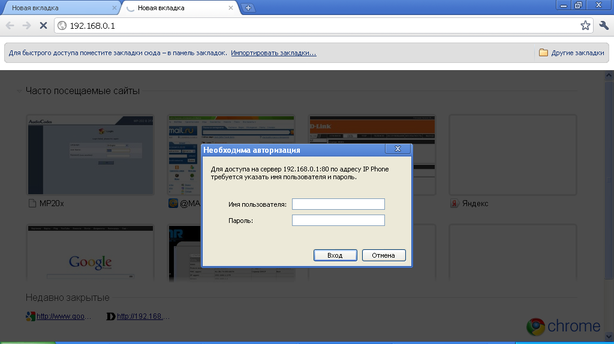
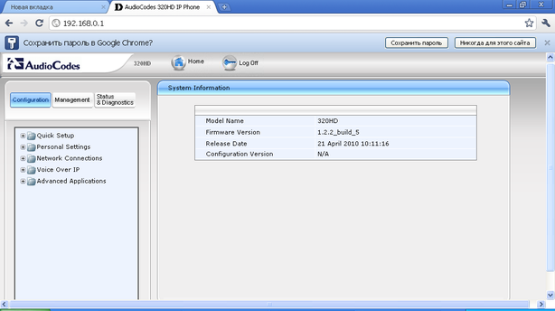
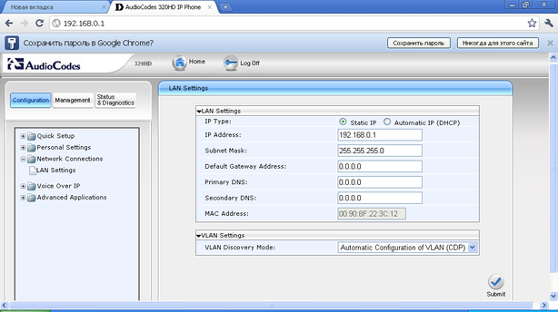
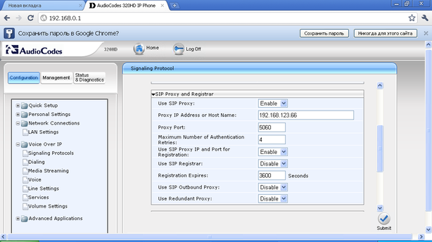
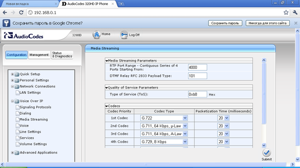

--- 
template: equipment.jade
title: 1
order: 10
---

## Настройка SIP телефона AudioCodes HD320
Настройка этого телефона осуществляется либо через web-интерфейс или из меню самого телефона.

По умолчанию на PC-порту данного телефона стоит получение адреса по DHCP. Для изменения этого параметра заходим на телефоне: «Menu->Administration» и вводим пароль (по умолчанию 1234). Затем заходим в Network Settings -> LAN Connection Type. Выбираем Static IP. По умолчанию статический IP-адрес телефона 192.168.0.1. Его можно изменить, нажав кнопку Edit. После всех изменений нажимаем кнопку Save. На компьютере выставляем соответственно IP-адрес из этой подсети, то есть вида 192.168.0.ХХХ, где ХХХ – число от 1 до 255, исключая 1. В адресной строке браузера вводим адрес 192.168.0.1 и увидим следующую форму авторизации(Рисунок 1):

По умолчанию имя пользователя – «admin», пароль – «1234». После успешной авторизации увидим следующее окно(Рисунок 2):

Заходим во вкладку «Network Connections -> LAN Settings». Увидим следующее окно(Рисунок 3):

Здесь устанавливаем параметры сети – IP-адрес, маску, шлюз, или получаем адрес автоматически. После ввода данных нажимаем кнопку «Submit».

Затем заходим во вкладку Voice over IP -> Signaling Protocol. Увидим следующее окно(Рисунок 4):

Здесь заполняем поля Proxy IP Address or Host Name – IP-адрес сервера регистрации.

Затем заходим во вкладку Media Streaming. Видим следующее окно(Рисунок 5):

Заполняем приоритетные кодеки. После всех изменений нажимаем кнопку Submit.

Затем заходим во вкладку Line Settings. Здесь заполняем User ID, Display Name, Authentication User Name – это логин, который выдан Вам для подключения, то бишь имя учетной записи. Authentication Password – пароль учетной записи. Затем нажимаем кнопку Submit. Настройка завершена, статус регистрации можно посмотреть во вкладке Status And Diagnostics -> System Status -> VoIP Status.