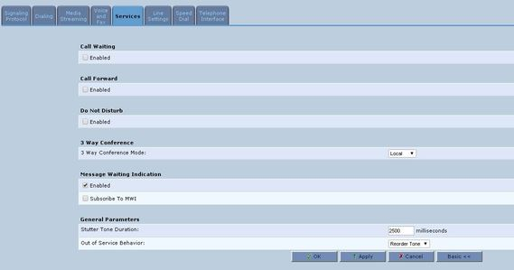

--- 
template: equipment.jade
title: 1
order: 10
---

## Настройка AudioCodes MP-202

Для конфигурирования устройства необходимо подключить его LAN порт непосредственно к сетевой карте компьютера, с которого будет производиться настройка, либо к локальной сети.

Установить IP адрес компьютера, с которого производится конфигурирование, на адрес из диапазона 192.168.2.2-254

Набрать в адресной строке браузера: http://192.168.2.1

Ввести в форму логина и пароля имеющиеся у вас данные (По умолчанию логин admin, пароль admin)

После авторизации нужно сконфигурировать встроенный фаерволл устройства. Щелкаем на горящей стене на главной странице.

Выбираем Minimum Security, затем нажимаем ОК. Это делается для того, чтобы исключить возможность блокирования встроенным фаерволлом устройства сип-трафика, что повлечет невозможность совершать звонки.

Заходим в Network Connections, выбираем редактирование Wan порта(карандаш напротив Wan Ethenet), заходим во вкладку Settings, выбираем DNS Server значение Use the Following DNS Server Adresses и в появившееся поля вбиваем значения  Primary DNS Server: 195.130.214.23, Secondary DNS Server: 8.8.8.8. Нажимаем Apply.

Переходим в пункт Voice Over IP в левом меню.

Нажимаем Advanced для полного отображения настроек.

Настройки должны выглядеть, как на скриншоте, за исключением Host Name or Address – сюда Вам надо вбить Ваш адрес сервера регистрации.

Вкладка Dialing

Вкладка Media Streaming. Здесь внимание надо уделить очередности кодеков.

 

Переходим во вкладку Voice and Fax.

В случае, если будет использоваться соединение по кодеку G.729 (обычное качество) настройки на данной странице должны выглядеть следующим образом:

В случае использования кодека G.711 (премиум качество) настройки должны выглядеть следующим образом:

Вкладка Services:

 
Вкладка Line Settings.

Настройки двух линий. По умолчанию они включены, но не настроены. Чтобы настроить первую линию жмем на изображение карандаша.

Попадаем на страничку настроек линии. Сюда нужно ввести данные SIP учетной записи. Логин учетной записи вводится в следующие 3 поля: User ID, Display Name и Authentication User Name. В поле Authentication Password вводим пароль SIP учетной записи.

Галочка Block Caller ID стоять не должна! Это отключает определитель номера!

Жмем ОК.

При необходимости настраиваем аналогичным образом вторую линию.

После настройки линии мы снова попадаем в пункт меню Line Settings. Теперь жмем там ОК.

На этом настройка основных параметров AudioCodes’а закончена и устройство можно подключить к сети интернет через порт WAN. Проверить статус подключения к сети можно в пункте меню System Monitoring.

Настройка AudioCodes MP202 в режиме моста

Для настройки оборудования в режиме моста изначально необходимо настроить статический IP-адрес на WAN интерфейсе устройства, так как создав мост между двумя интерфейсами, стандартным способом, через LAN-интерфейс, набрав в адресной строке http://192.168.2.1, Вы уже не сможете зайти на интерфейс устройства. Так что установка статического IP-адреса позволит в дальнейшем избежать сброса настроек для повторного входа в веб-интерфейс. Вообще после установки моста можно найти AudioCodes MP202 в списке клиентов DHCP-сервера на маршрутизаторе, но иногда данный способ попросту недоступен из-за отсутствия возможности зайти на веб-интерфейс маршрутизатора(неизвестны логин/пароль).

Установка статического IP-адреса осуществляется в разделе «Network Connections»:

Редактируем раздел настроек WAN-интерфейса

Заходим во вкладку «Settings» и в разделе «Internet Protocol» выбираем «Use the following IP address» и прописываем статические настройки IP-адресации(адрес, маска, основной шлюз)

Далее добавляем новое соединение в разделе «Network connections», нажимаем Next

Выбираем тип соединения —  »Advanced Connection»

Далее выбираем «Network Bridging»

Выбираем оба интерфейса, нажимаем кнопку Next

Далее нажимаем Finish

Для проверки и редактирования созданного соединения подключаемся ноутбуком/компьютером к WAN-порту, настраиваем IP-адресацию на компьютере согласно ранее установленным настройкам на AudioCodes MP202.