--- 
template: equipment.jade
title: 1
order: 10
---

## Подключение 1С-Битрикс24
Данная инструкция поможет вам подключить систему 1С-Битрикс24 к Виртуальной АТС Мобилон.

 

В первую очередь необходимо создать абонента, в качестве которого будет происходить регистрация системы 1С-Битрикс на Виртуальной АТС Мобилон. Для этого перейдите в раздел Абоненты, создайте там нового абонента (если он еще не создан в вашем аккаунте) и нажмите кнопку «Просмотр», как показано на рисунке:

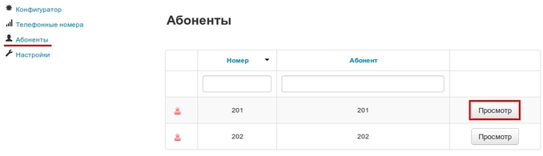

 

 

Далее в Абоненте выберите меню «Учетные записи» и нажмите кнопку «Просмотр», как показано на рисунке:

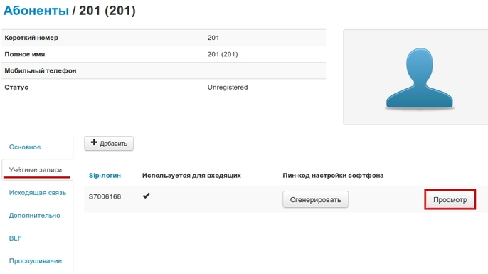
 

Вы перейдете на страницу с учетными данными выбранного абонента. Необходимая информация с этой страницы: Sip-логин, пароль и сервер

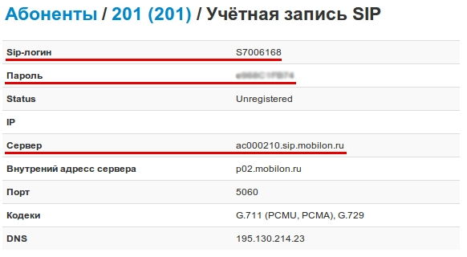

Затем перейдите в систему 1С-Битрикс24, в ваш аккаунт. В левой панели перейдите по ссылке «Управление номерами» в разделе «Телефония»

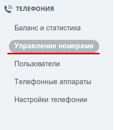

Следующим шагом выберите опцию «Подключить SIP АТС»

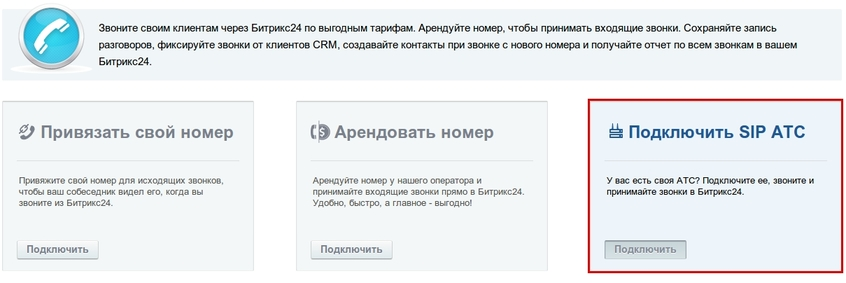

 

Потом выберите меню «Подключить Облачную АТС» и заполните необходимые поля данными из учетной записи вашего абонента на Виртуальной АТС Мобилон и нажмите кнопнку «подключить».

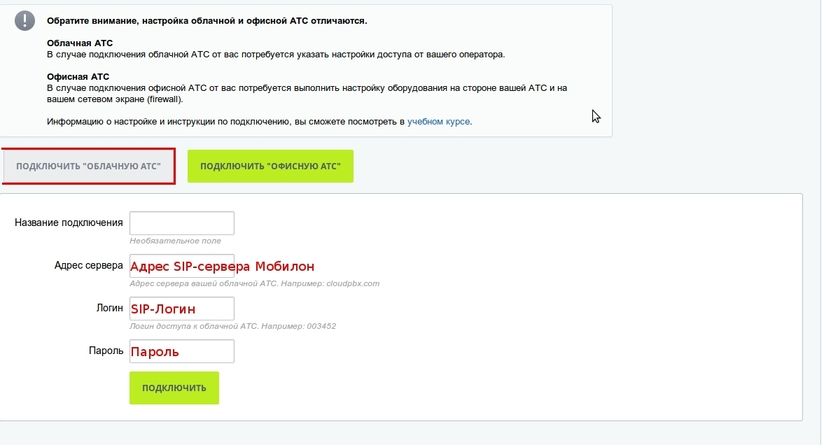

 

Если вы все сделали правильно то в списке абонентов на Виртуальной АТС Мобилон учетная запись выбранного вами абонента должна подсветиться зеленым:

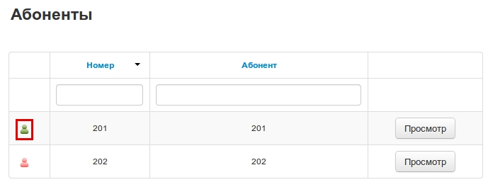

Теперь необходимо создать пользователя телефонии в системе 1С-Битрикс24. Перейдите по ссылке «Пользователи» в разделе «Телефония» в личном кабинете вашей учетной записи в 1С-Битрикс. На появившейся странице выберите нужного вам пользователя, и нажмите на ссылку «настроить»:

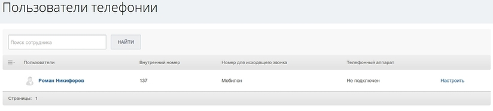

 

В появившемся окне заполните необходимые данные: внутренний номер, номер используемый для исходящих звонков, и поставьте отметку в поле «Вкл телефонный аппарат».

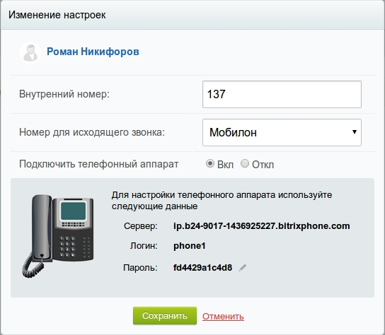

Далее вам необходимо настроить ваш IP-телефон, либо SIP-шлюз в соответствие в указанными данными. Инструкции по настройке множества видов различного оборудования доступны по ссылке Настройка IP-оборудования и софтфонов возможно там вы найдете инструкцию по настройке необходимого вам оборудования.

Следующим шагом необходимо настроить возможность корректно совершать исходящие звонки от пользователей зарегистрированных в системе 1С-Битрикс24 через SIP линию от компании Мобилон.
Поскольку при совершении исходящих звонков из системы 1С-Битрикс телефонный номер всегда отправляется в виде «7 (код города) номер абонента», даже если вы набираете его в виде «8 (код города) номер абонента» то на Виртуальной АТС Мобилон нужно будет сделать обратную замену 7-ки на 8-ку. Это делается следующим образом:
Перейдите в меню «Конфигуратор АТС»:

 

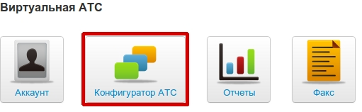

 

Затем в левой панели перейдите по ссылке «Настройки»

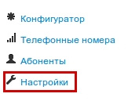

 

Следующим шагом необходимо создать правило маршрутизации звонков, которое будет менять набранные номера с вида 7XXXXXXXXXX на 8XXXXXXXXXX, где X — любая цифра от 0 до 9. Для создания правила зайдите в меню «Маршрутизация», пункт «Исходящие маршруты».

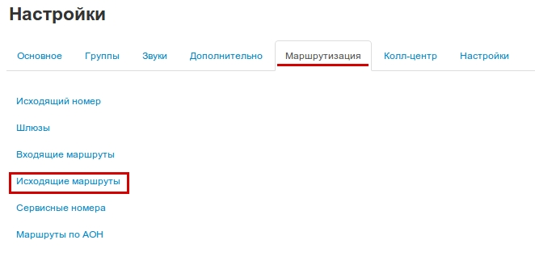

Нажмите кнопку «Добавить» и в появившемся окне пропишите необходимое правило так, как это показано на рисунке:

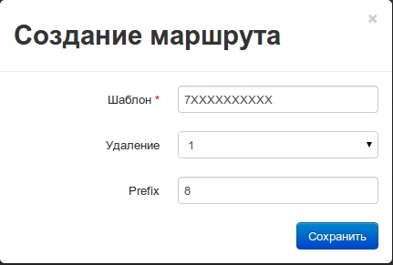

Нажмите кнопку сохранить.

Обратите внимание, что в шаблоне необходимо набирать латинскую букву X (икс) в английской раскладке клавиатуры.

После создания шаблона маршрута необходимо указать как маршрутизировать вызов для данного шаблона, в созданном шаблоне добавляем АОН.

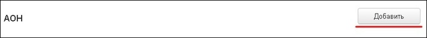

По нажатию кнопки Добавить появится окно настроек АОН. Настройки АОН необходимо произвести в соответствии со следующим рисунком:

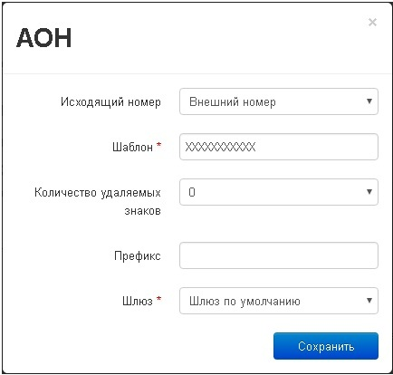

Нажмите кнопку сохранить и подождите, пока маршрут применится.

Обратите внимание, что в шаблоне необходимо набирать латинскую букву X (икс) в английской раскладке клавиатуры.

Далее все необходимые настройки для работы с системой 1С-Битрикс24 производятся по ссылкам в разделе «Телефония» в личном кабинете системы Битрикс.

 

#### Важно

В связи с особенностями телефонии системы 1С-Битрикс24 необходимо знать следующее:

1. Система 1С-Битрикс24 работает по кодеку G.711 доступному только на тарифах класса «Премиум» у компании Мобилон. Соответственно, если у вас подключен тариф класса «Стандарт» то перед подключением системы 1С-Битрикс необходимо перейти на тариф класса «Премиум».