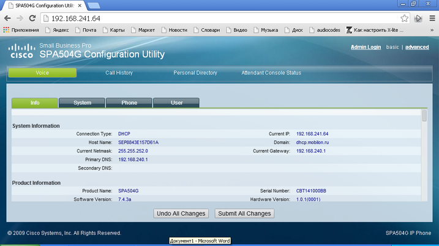
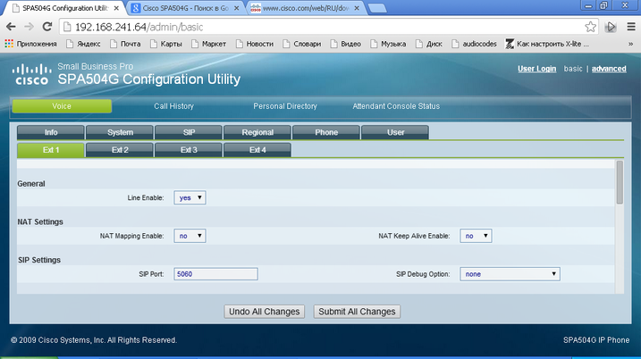
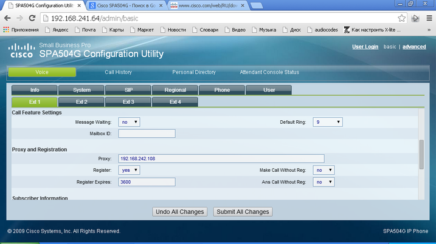
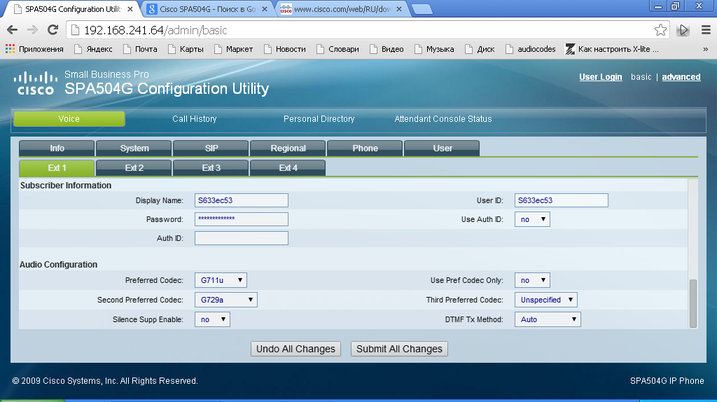

--- 
template: equipment.jade
title: 1
order: 10
---

## Настройка SIP телефона Cisco SPA504G
Настройка телефона производится через веб-интерфейс.

Далее нажимаем кнопку «Admin Login».

Данный телефон имеет возможность настройки 4-х SIP-регистраций. Для настройки параметров SIP-подключения необходимо зайти в разделы «Ext1…4» и осуществляем следующие настройки:

Здесь «Line Enable» выставляем в Yes:

Далее в разделе «Proxy and Registration» настраиваем следующие параметры:

Proxy – адрес SIP-сервера;

Register – активация регистрации, должна стоять в Yes;

Register Expires – период перерегистрации.

Далее в разделе «Subscriber Information» выставляем следующие данные:

Display Name – отображаемое имя учтенной записи на телефоне;

User ID – имя учтенной записи;

Password – пароль учетной записи.

В разделе «Audio Configuration» выставляем необходимые приоритеты и параметры кодеков.

Далее нажимаем кнопку «Submit All Changes» для применения настроек.

На этом основные настройки SIP завершены.