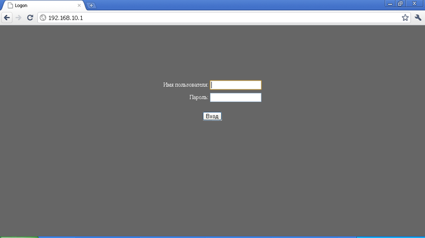
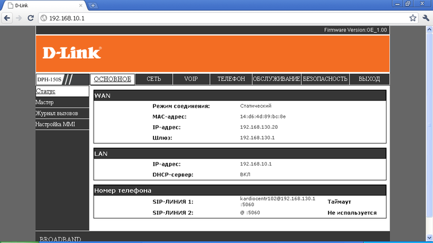
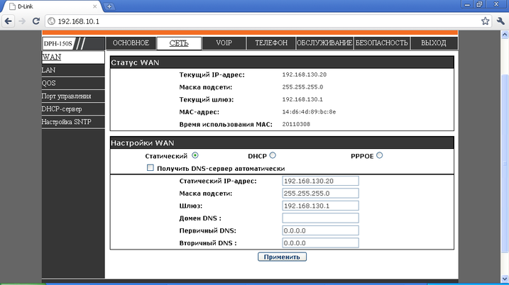
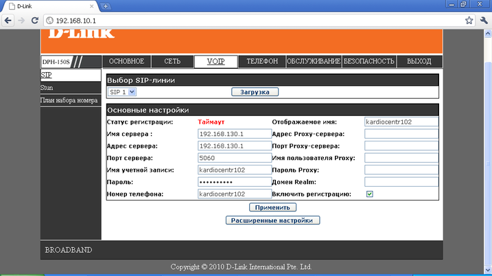
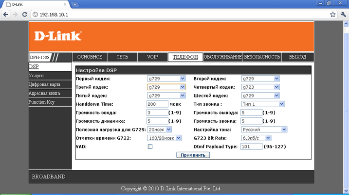

--- 
template: equipment.jade
title: 1
order: 10
---

## Настройка SIP телефона D-link DPH150SE
Настройка этого телефона осуществляется либо через web-интерфейс или из меню самого телефона.

Стандартный IP-адрес на LAN-порту 192.168.10.1 (указан на обратной стороне телефона, на наклейке). На компьютере выставляем соответственно IP-адрес из этой подсети, то есть вида 192.168.10.ХХХ, где ХХХ – число от 1 до 255, исключая 1.

Вводим в адресной строке браузера адрес 192.168.10.1 и видим следующее меню(Рисунок 1):

Стандартное имя пользователя – admin, стандартный пароль – admin. Эту информацию так же можно увидеть на обратной стороне телефона. После успешной авторизации увидим следующее окно(Рисунок 2):

Во вкладке «Сеть» настраиваем IP – параметры сети (по DHCP или статический IP-адрес, маска, шлюз, DNS) — Рисунок 3:

После всех изменений нажимаем кнопку «Применить».

Затем заходим во вкладку VoIP и настраиваем параметры SIP-линии(Рисунок 4):

Здесь необходимо указать имя и адрес сервера регистрации , порт сервера регистрации SIP (обычно 5060), затем заполняем следующие поля:

Имя учетной записи – логин учетной записи, выданный куратором.

Пароль – пароль учетной записи, выданный куратором в технических данных.

Номер телефона – ОБЯЗАТЕЛЬНО  логин учетной записи, выданный куратором.

Отображаемое имя – любая запись, но лучше тоже указать логин (эта надпись будет отображаться на экране телефона).

Остальные поля не заполняем. ОБЯЗАТЕЛЬНО ставим галочку «Включить регистрацию». После сделанных изменений нажимаем кнопку «Применить».

В расширенные настройки не лезем, они понадобятся только в экстренных случаях.

Далее заходим во вкладку «Телефон». Видим следующее окно (Рисунок 5):

Здесь настраиваем параметры кодеков. В графе «Настройка тона» выставляем «Русский».

После всех изменений нажимаем кнопку «Применить».

Настройка завершена, статус регистрации можно посмотреть во вкладке VOIP.