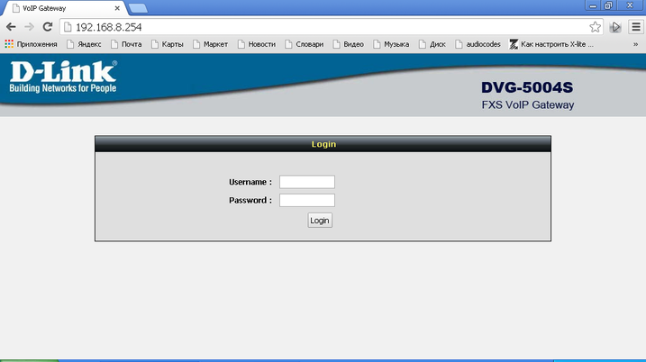
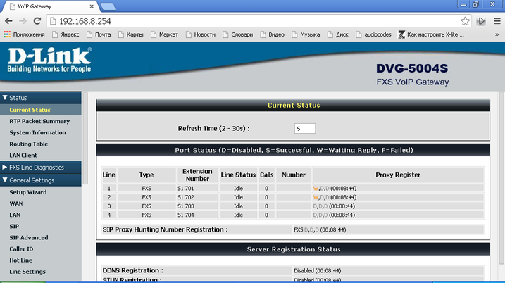
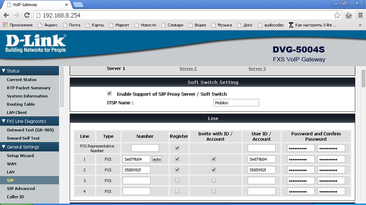
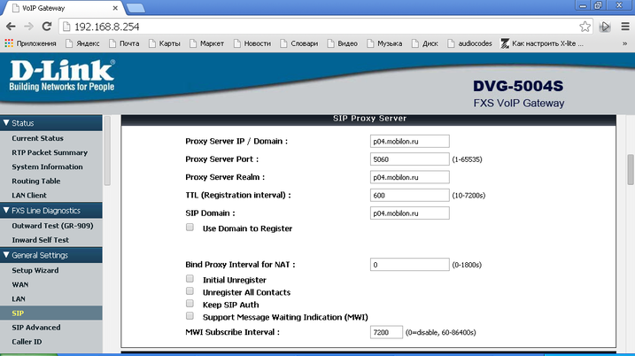
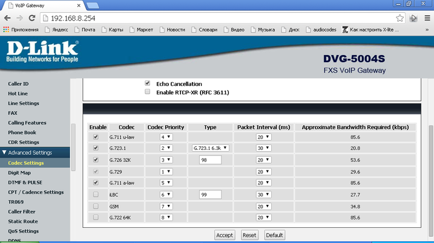

--- 
template: equipment.jade
title: 1
order: 10
---

## Настройка SIP шлюза D-link DVG5004S
Настройку данного шлюза осуществляем через веб-интерфейс. Для настройки необходимо подключиться к одному из LAN­-портов шлюза и выставить IP-адрес вида 192.168.8.XXX, где XXX – число от 1 до 253, либо выставить автоматическое получение IP-адреса.

Затем необходимо через браузер зайти на веб-интерфейс шлюза по адресу: http://192.168.8.254 . Увидите следующую форму авторизации:

Логин и пароль по умолчанию – пустые поля.

После успешной авторизации увидим следующее окно:

Для настройки SIP заходим во вкладку General Settings -> SIP:

Отмечаем пункт «Enable Support of SIP Proxy Server/Soft Switch»

Далее в разделе Line заполняем следующие поля:

Number – имя учетной записи

User ID/Account – имя учетной записи

Password and Confirm Password – пароль учетной записи

Так же необходимо поставить галочки в пунктах Register и Invite with ID/Account.

В данном пункте необходимо обратить внимание, что поля Number в настройках линии НЕ ДОЛЖНЫ оставаться пустыми ( иначе D-link выдаст ошибку).

То есть если Вам необходимо настроить 2 учетных записи, то остальные линии оставляем без изменений ( по умолчанию в поле Number выставлено значение 70X, где X- номер линии от 1 до 4).

Далее в разделе SIP Proxy Server необходимо выставить следующие настройки:

Proxy Server IP/Domain – доменное имя или IP-адрес SIP-сервера;

Proxy Server Port – обычно 5060;

Proxy Server Realm –  доменное имя или IP-адрес SIP-сервера;

TTL(Registration interval) – можно оставить стандартное значение 600 сек, это период перерегистрации оборудования.

Так же необходимо проверить настройки кодеков, установленных на оборудовании в разделе Advanced Settings -> Codec Settings:

На этом основная настройка SIP закончена, можно подключать телефоны и пользоваться телефонной связью.

