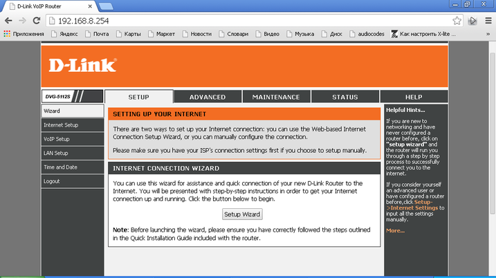

--- 
template: equipment.jade
title: 1
order: 10
---

## Настройка SIP шлюза D-link DVG5112S
Для настройки VoIP-шлюза D-link DVG5112S необходимо подключится к LAN-порту и ввести в веб-браузере адрес http://192.168.8.254 (Рисунок 1):

Данные для входа на веб-интерфейс следующие:

Логин: admin

Пароль: {пусто}

После успешной авторизации мы увидим следующее окно(Рисунок 2):

Для настройки SIP-подключения необходимо зайти во вкладку VoIP Setup->Setup (Рисунок 3):

Здесь необходимо поставить галочку в разделе «Soft Switch Settings».

Далее в разделах «Phone1, Phone2» необходимо ввести следующие данные:

Number – логин учетной записи;

User ID/Account –логин учетной записи;

Password, Confirm Password – пароль.

Так же необходимо поставить галочку в пунктах «Register» и «Invite with ID/Account».

Раздел «SIP Proxy Server» должен быть настроен следующим образом(Рисунок 4):

Proxy Server IP/ Domain – IP-адрес или доменное имя сервера регистрации;

Proxy Server Port – порт для сигнального трафика, обычно 5060;

Proxy Server Realm — IP-адрес или доменное имя сервера регистрации;

SIP Domain — IP-адрес или доменное имя сервера регистрации.

Далее во вкладке «Advanced -> VoIP Codec» необходимо выставить кодеки, используемые у клиента(Рисунок 5):

Далее во вкладке «Maintenance->Backup and Restore» необходимо поставить галочку «Save All Settings» и нажать кнопку «Reboot»(Рисунок 6):

Статус регистрации учетной записи можно посмотреть во вкладке «Status -> VoIP Status».

Так же со шлюза есть возможность произвести простейшую диагностику доступа до какого-либо узла (например, SIP-сервера) через раздел «Maintenance->Diagnostic» путем отправки ICMP-запросов.

При частой потере регистрации устройства на сервере необходимо проверить следующие параметры:

За время перерегистрации в нормальном состоянии(подключен к серверу) отвечает параметр TTL, по умолчанию стоит 360 сек. Для нормальной работы стоит выставить значение параметра в 120-180 сек.