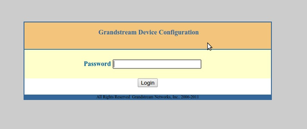
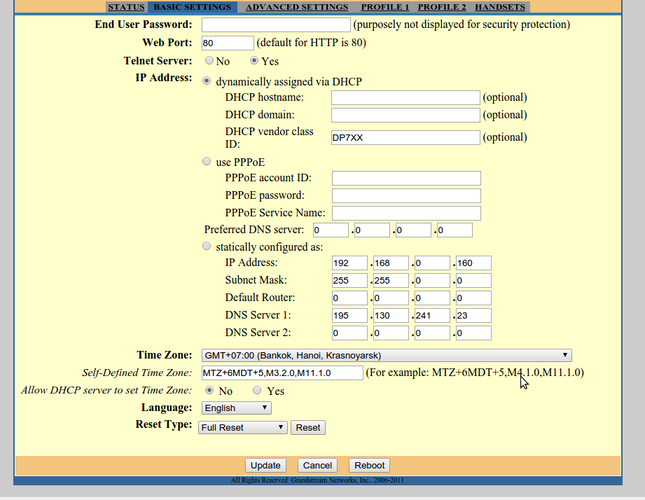
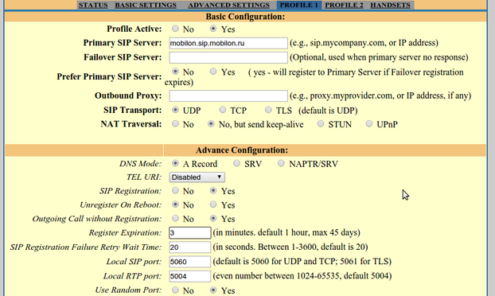
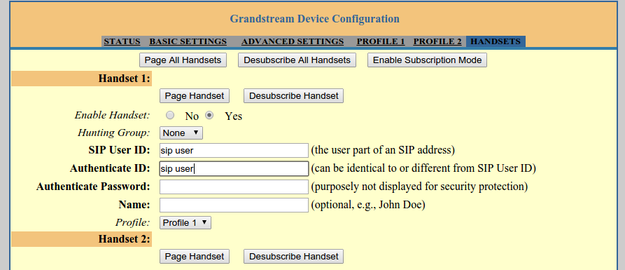

--- 
template: equipment.jade
title: 1
order: 10
---

## Настройка SIP телефона Grandstream DP715

Подключаем базу к локальной сети и сети питания.

Для входа в меню Интерактивных Голосовых Подсказок,
на зарегистрированном телефоне-трубке нажмите кнопку вызова, а затем ***. Для того что бы узнать IP-адрес вводим 02.

Вводим уже известный IP-адрес базовой станции в браузере вашего ПК.
Пароль для доступа к Веб интерфейсу по умолчанию “admin”. (Рис.1)

Перейдя во вкладку BASIC SETTING, видим, что устройство получает по умолчанию IP-адрес по DHCP. В этом случае необходимо только прописать DNS 195.130.214.23 для успешной регистрации учетных записей. Если необходимо указать статический IP-адрес, то выбрав нужный параметр, прописываем нужные данные, так же указав DNS. Что бы время на телефоне отображалось корректно, выставляем нужный часовой пояс. Сохраняем настройки кнопкой Update (Рис.2)

Далее переходим во вкладку PROFILE 1. В соответствующих пунктах пишем сервер регистрации. (Рис.3)

Прокручиваем страницу вниз до пункта Codec Configuration и выставляем приоритет голосовых кодеков и сохраняем все кнопкой Update. (Рис.4)

Теперь переходим во вкладку HANDSETS. Выбираем нужную трубку Handset 1 (Трубка 1) прописываем данные учетной записи. Прокручиваем страницу вниз, и сохраняем данные, нажав кнопку Update. (Рис.5)

Для Регистрации дополнительной трубки.
a)Нажимаем на телефонной трубке верхнюю правую кнопку.
б) При помощи джойстика находим пункт Handset (трубка) и для подтверждения выбора жмём верхнюю правую кнопку.
в) Вновь при помощи джойстика находим пункт Registration и подтверждаем правой верхней кнопкой (галочка).
г) Тут выбираем пункт Register, затем Base 1.
д) Вводим PIN базового блока (по умолчанию: 0000) и подтверждаем правой верхней кнопкой (галочка).
На этом этапе на дисплее появится надпись «Перезагрузите базу». Это необходимо, так как станция находится в режиме регистрации новых трубок. Перезагрузить базу можно через веб-интерфейс или кратковременным отключением питания.

Телефон-трубка начнет поиск базового блока и после его обнаружения – зарегистрируется. После успешной регистрации на дисплее будет отображен режим готовности, а также имя и номер трубки.
