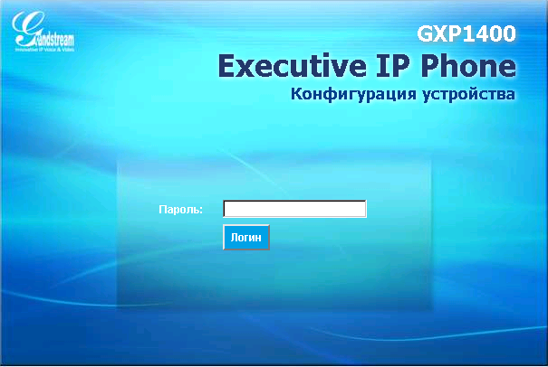
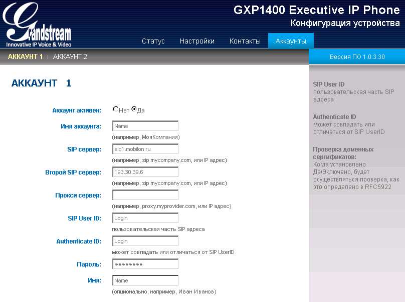
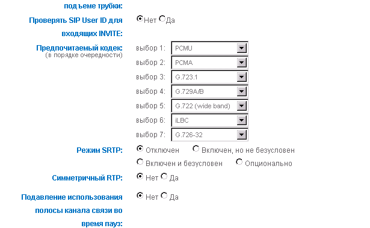
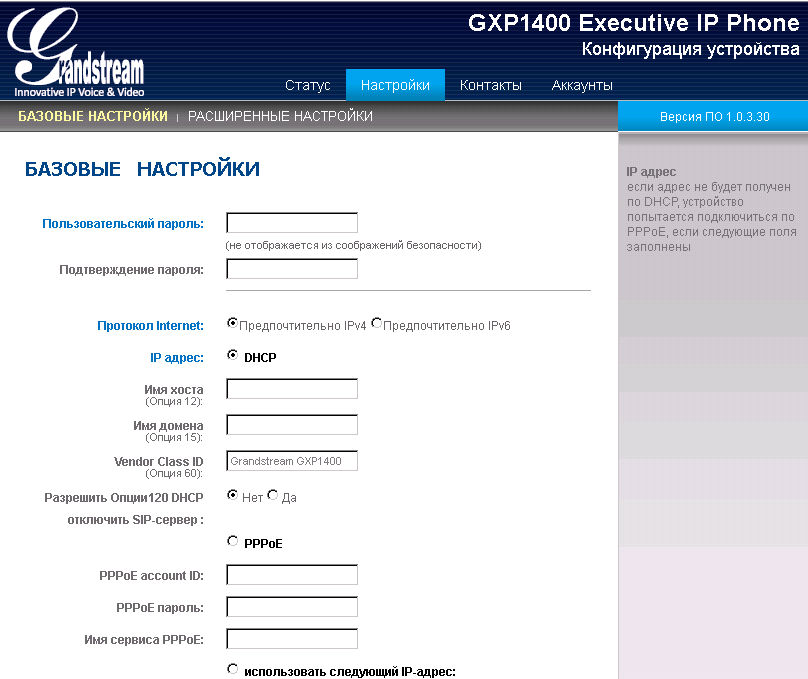
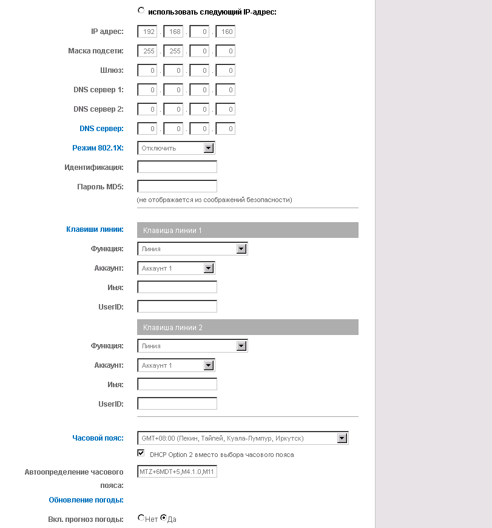
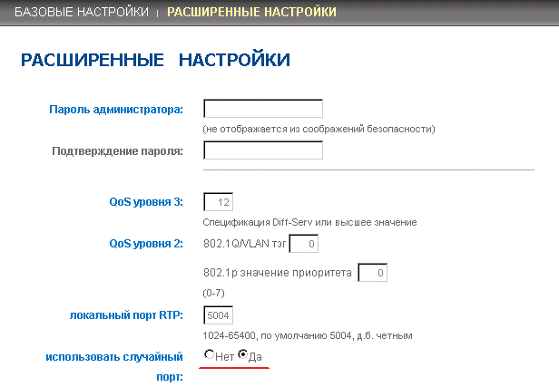

--- 
template: equipment.jade
title: 1
order: 10
---

## Настройка IP телефона Grandstream GXP1400
По поводу прошивки.

На настоящий момент с официального HTTP сервера можно обновиться лишь до самой последней бета версии(firmware.grandstream.com/BETA). Для обновления на stable придется поднимать свой http\tftp сервер, залить туда файлы прошивки и обновляться оттуда.

Что бы обновить устройство со старой версии прошивки до актуальной, необходимо обновиться до промежуточной версии прошивки:

http://malab.grandstream.com/firmware/GXP21XX/1.0.5.23/gxp1400fw.bin

Затем обновляемся до последней:

http://www.grandstream.com/sites/default/files/Resources/Release_GXP140x_1.0.8.6.zip

 
Настройка данного телефона осуществляется либо через web-интерфейс, либо через меню самого телефона.
Если нет возможности получить IP-адрес по DHCP, то нужно нажать круглую кнопку справа, выбрать пункт «Сеть», затем заново нажать центральную кнопку, «Настройки IP», выбрать «Статический IP» путём нажатия круглой кнопкой, далее «IP» — ввести необходимый адрес, затем ввести по аналогии маску подсети. После этого необходимо подключиться компьютером в LAN-порт телефона и выставить в настройках ПК статический адрес с той же подсетью и маской что и на телефоне.
В случае получения адреса по DHCP, необходимо дважды нажать левую кнопку под дисплеем с надписью «Экран». Телефон отобразит ip-адрес, который был получен по DHCP.
Далее на него можно зайти через web-интерфейс по соответствующему адресу (Рис.1), пароль по умолчанию admin.

Далее переходим во вкладку «Аккаунты» и вводим пароль admin (Рис. 2)

Имя аккаунта – отображаемое имя
SIP сервер – сервер регистрации
Второй SIP сервер – можно не указывать
SIP User ID – Логин
Authenticate ID – Логин
Пароль – Пароль
Имя – Можно не писать
Далее, необходимо указать используемые кодеки:

G711 U-law в данной модели телефона обозначен как PCMU.
G711 A-law – соответственно как PCMA.
Если используется G729, то он указывается первым в приоритете. При использовании G711, первыми в приоритете указываются оба варианта G71.
Остальные параметры без изменений (Рис. 3)

Применить настройки можно кнопкой «Обновить».
Проверить регистрацию можно во вкладке «Статус».

Сетевые настройки выставляются во вкладке «Настройки», «Базовые настройки». Можно получить адрес по DHCP, либо выставить статический адрес, либо настроить PPPoE соединение.

Остальные настройки можно не трогать. При желании можно изменить формат отображения даты и тд.
При подключении нескольких IP-телефонов необходимо перейти во вкладку «Расширенные настройки» и поставить случайное распределение портов (Рис. 6)

Данную опцию имеет смысл устанавливать в том случае, если вы устанавливаете несколько телефонов в одном сегменте локальной сети.

При частой потери регистрации устройства на сервере необходимо проверить следующие параметры:

1. За время перерегистрации в нормальном состоянии(подключен к серверу) и при ошибке регистрации отвечает параметр Register Expiration, по умолчанию установлен в 3600 сек. Для нормальной работы стоит выставить значение параметра в 120-180 сек.

2. За время перергистрации после неудачной попытки отвечает параметр SIP Registration Failure. Должен быть установлен в 20 сек.

3. За поддержание соединения в открытом состоянии отвечает параметр NAT Traversal. По умолчанию режим Keep-Alive.