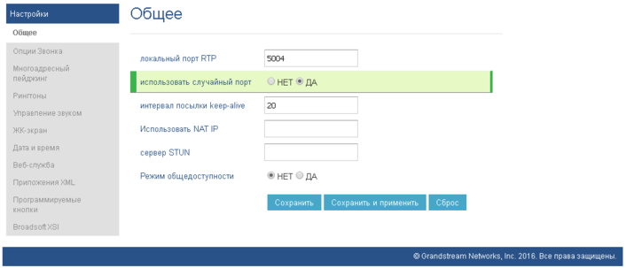

--- 
template: equipment.jade
title: 1
order: 10
---

## Настройка IP телефона Grandstream GXP1620/1610
Настройка данного телефона может осуществляться либо через web-интерфейс, либо через меню самого телефона. Рассмотрим вариант настройки телефона через web-интерфейс, так как данный вариант более наглядный.

1. Установка сетевых параметров для подключения телефона к локальной сети.
По умолчанию при подключении телефон получает IP-адрес автоматически от Вашего сервера DHCP. Что бы узнать какой адрес получил телефон необходимо дважды нажать левую кнопку под дисплеем с надписью «Экран».

Если нет возможности получить IP-адрес автоматически по DHCP, то нужно присвоить его вручную, для этого нажмите круглую кнопку справа (Вход в меню), выберите пункт (подтверждение выбранного пункта производится круглой кнопкой — Вход в меню): Сеть \ Настройки IP \ Статический IP \ IP  — ввести необходимый адрес, затем ввести по аналогии маску подсети, адрес основного шлюза и адрес DNS сервера. После применения сетевых параметров, телефон можно подключить в Вашу локальную сеть используя LAN-порт телефона. В данную модель телефона встроен коммутатор, при необходимости к телефону можно подключить компьютер или другие сетевое устройство, используя PC-порт.

Зная присвоенный телефону IP-адрес, на телефон можно зайти через web-интерфейс используя web-браузер и соответствующий телефону адрес (Рис.1). Учетные данные по умолчанию admin, admin.

2. Настройка SIP аккаунта
Переходим в раздел УЧЕТНЫЕ ЗАПИСИ \ АККАУНТ 1 и вводим SIP-учетные данные (Рис. 2). Учетные данные можно получить в личном кабинете Виртуальная АТС Мобилон или запросив данные у Вашего менеджера.

После заполнения полей отмеченных на рисунке выше зеленым, учетными данными, нажмите кнопку Сохранить и применить.

Далее, необходимо указать используемые кодеки. Перейдите в раздел Настройки звука и укажите используемые кодеки, в зависимости от выбранного тарифного плана.
G711 U-law в данной модели телефона обозначен как PCMU.
G711 A-law – соответственно как PCMA.
Если используется G729, то он указывается первым в приоритете. При использовании G711, первыми в приоритете указываются оба варианта G711.
Остальные параметры без изменений (Рис. 3)

Примените настройки нажатием кнопки Сохранить и применить.

После произведенных настроек телефонный аппарат должен получить регистрацию на сервере телефонии Мобилон. Проверить регистрацию можно в разделе СОСТОЯНИЕ\ Состояние учетной записи. Пример успешной регистрации (Рис.4)

3. Настройка сетевых параметров
При необходимости можно откорректировать сетевые параметры телефона. В разделе СЕТЬ \ Стандартный, доступны настройки режима сети Статический IP, DHCP или PPPoE. В разделе СЕТЬ \ Расширенные настройки, доступны дополнительные настройки, например вкл/выкл PC-порт телефона или назначить VLAN-тег на PC-порт.

4. Дополнительные рекомендуемые параметры телефона
В случае если к локальной сети подключены несколько IP-телефонов рекомендуется использовать случайное выделение порта для телефона, параметр доступен в разделе НАСТРОЙКИ \ Общее (Рис. 5)

 

Для корректной работы телефона из локальной сети рекомендуется включить режим преодоления NAT сервера Keep Alive, необходимые параметр доступны в следующих разделах УЧЕТНЫЕ ЗАПИСИ \ АККАУНТ 1 \ Настройки сети (Рис. 6) и УЧЕТНЫЕ ЗАПИСИ \ АККАУНТ 1 \ Настройки SIP (Рис. 7)

 

 Для исключения поступления на телефон анонимных вызовов необходимо включить следующий параметр, доступен в разделе УЧЕТНЫЕ ЗАПИСИ \ АККАУНТ 1 \ Настройки вызовов (Рис. 8)

 

Телефон поддерживает функцию оповещения о входящем вызове во время разговора, для настройки данной функции нужно перейти в раздел НАСТРОЙКИ \ Опции звонка (Рис. 9)

Изменение остальных параметров зачастую не требуется.