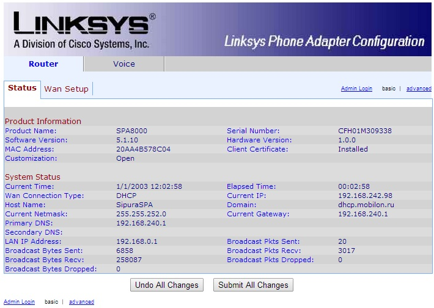
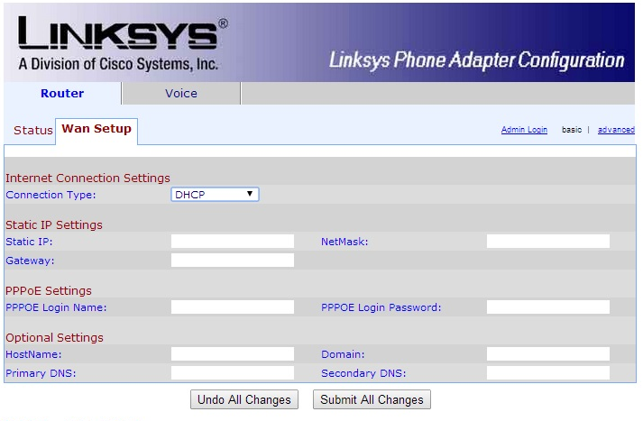
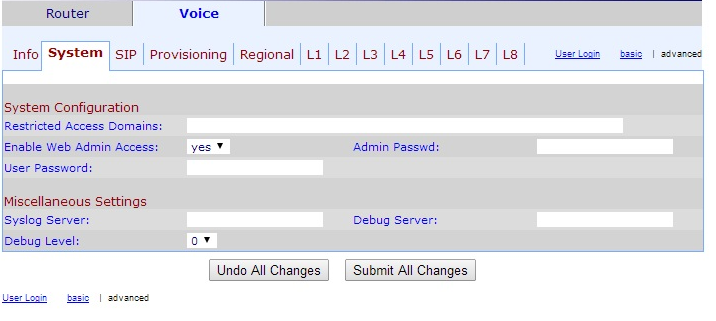
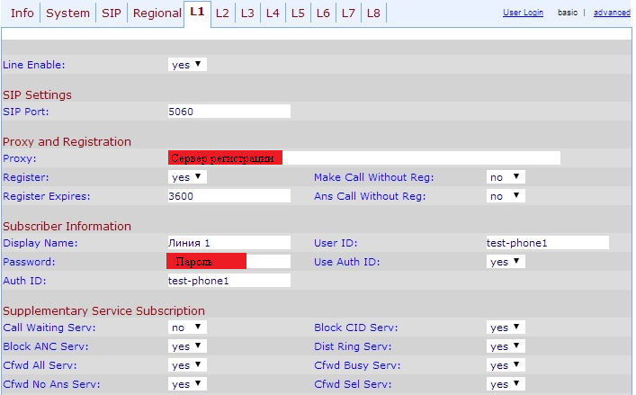
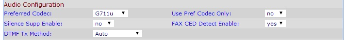
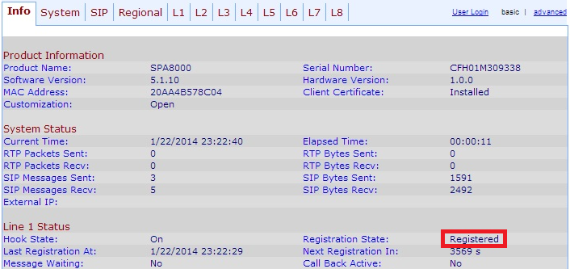
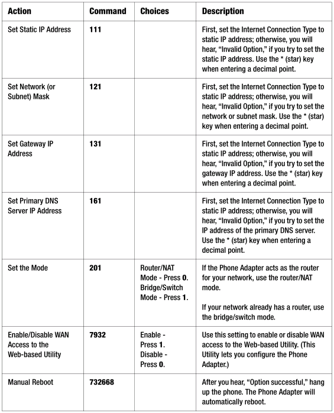
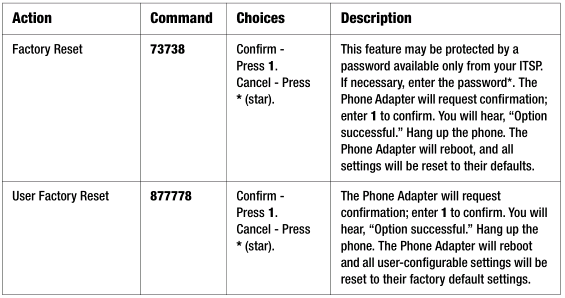
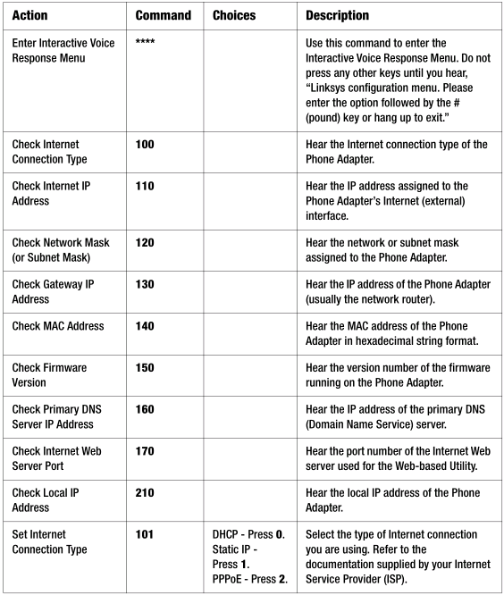

--- 
template: equipment.jade
title: 1
order: 10
---

## Настройка Linksys SPA8000
Подключите устройство в локальную сеть через порт «ETHERNET» и подключите телефонный аппарат в любой порт оборудования, убедитесь, что он находится в тональном режиме набора. Далее с помощью телефона вы сможете настроить доступ к сети и к веб-интерфейсу через голосовое меню оборудования. Для доступа в меню вам необходимо набрать **** (4 нажатие звездочки), когда услышите голосовое сообщение, вы сможете набрать цифровой код необходимой вам команды. Обратите внимание, в конце каждого кода необходимо набрать # для оповещения оборудования об окончании ввода кода.
В первую очередь вам необходимо включить доступ к веб-интерфейсу, в голосовое меню введите шифр 7932, за тем, что бы включить доступ – нажмите 1, если необходимо будет отключить – 0.
Далее необходимо выбрать статически или динамически назначать адресацию на порту, который подключен в локальную сеть. Для этого нужно использовать шифр 101 для изменения типа соединения, после ввода команды будет предложено выбрать, какой именно тип соединения вам нужен. Наберите 0 для выбора DHCP и 1 для статического назначения IP-адреса. Далее рассматриваются варианты дальнейших действий для того или иного варианта.

Для DHCP
Теперь необходимо узнать, какой IP-адрес назначен на порту, который подключен к вашей локальной сети, для этого в голосовом меню необходимо ввести код 110. Далее вам будет продиктован адрес по одной цифре на английском языке. Если адрес определен, заходите с любого компьютера локальной сети через веб-браузер на адрес, который вы выяснили и переходите к следующему пункту инструкции «Настройка через WEB-интерфейс». Если адрес не определен, то необходимо его прописать статически из диапазона свободных адресов. Не забудьте изменить тип соединения на статическое назначение адреса перед настройкой.

Для статического IP-адреса
В этом варианте вам необходимо будет ввести через телефонный аппарат IP-адрес, который вы хотите назначить, маску подсети, шлюз по умолчанию и возможно вам понадобится еще DNS-сервер. Во всех вышеперечисленных адресах точка между октетами заменяется *, например, для ввода адреса 192.168.3.9 вам необходимо будет ввести через телефонный аппарат 192*168*3*9. Телефонные команды для ввода адреса 111, для ввода маски – 121, для шлюза по умолчанию – 131, для DNS-сервера – 161. Далее заходите с любого компьютера локальной сети через веб-браузер на адрес, который вы установили и переходите к настройкам через WEB-интерфейс.

Так же можно подключиться к локальной сети самого устройства. Подключитесь патч-кордом к «AUX» порту устройства, по умолчанию на нем назначен IP-адрес 192.168.0.1, однако лучше перепроверить с помощью команды для телефонного аппарата 210. На своем компьютере установите получение адреса автоматически, или назначьте статический IP из подсети устройства. После открывайте браузер на подключенном компьютере и вводите в адресную строку IP-адрес, который вы выяснили, затем переходите к настройкам через WEB-интерфейс.
Полный список телефонных шифров находится в приложении в конце инструкции (на английском языке)

Настройка через WEB-интерфейс
Если вы правильно провели настройки по одному из вариантов, то вы увидите интерфейс устройства, где вы можете провести все необходимые настройки. 

В первую очередь вам необходимо перейти в режим администратора, для этого нажмите «Admin Login».

Если вам необходимо изменить тип подключения, перейдите во вкладку «WanSetup» и выберите необходимый способ подключения к локальной сети для доступа в Интернет. Если вам нужен тип подключения отличный от DHCP, то заполните блок для соответствующего типа подключения требуемыми данными. После внесения параметров нажмите кнопку «Submit All Changes» внизу окна для применения всех изменений. Теперь устройство готово к подключению в локальную сеть через порт «ETHERNET».

Перейдите во вкладку «Voice», потом подвкладку «System» и нажмите кнопу «advanced», для отображения всех доступных настроек. Здесь вы можете настроить пароли для доступа к режиму пользователя (UserPassword) и администратора (Admin Passwd), а так же разрешить или запретить подключение к устройству на интерфейс «ETHERNET» с помощью опции «Enable Web Admin Access».

Далее перейдите в подвкладку L1 (Рис. 4) для настройки линии номер 1. Здесь вам необходимо ввести учетные данные для подключения к SIP-серверу:

— Адрес SIP-сервера в поле «Proxy»;

— Логин учетной записи в поля «UserID» и «AuthID»;

— Пароль в поле «Password».

Так же, если вы не хотите, что бы во время разговора мог поступать второй вызов на телефон, поставьте опцию «Call Waiting Serv» в режим «no».

Теперь в том же окне настроек вам необходимо найти блок с настройками, который называется «AudioConfiguration», и в опции «Preferred Codec» выберите кодек, использование которого предусматривает ваш тариф.

После перейдите в подвкладку «Info», здесь вы можете проверить статус регистрации на SIP-сервере, в случае успешной регистрации в блоке «Line 1 Status» напротив пометки «RegistrationState» будет написано «Registered».

Аналогично настраивается каждая линия в подвкладках L2, L3 и т.д.

Коды для программирования с телефонного аппарата

