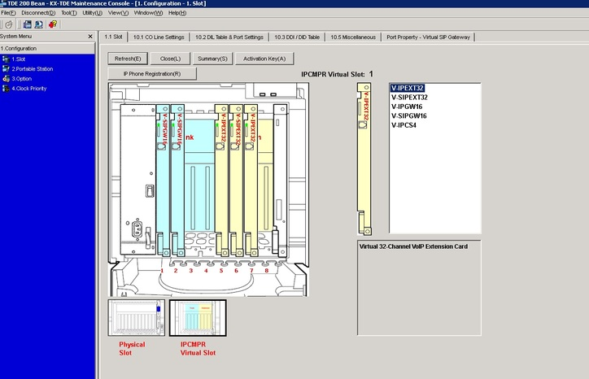
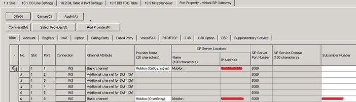
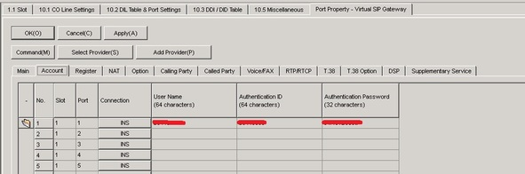
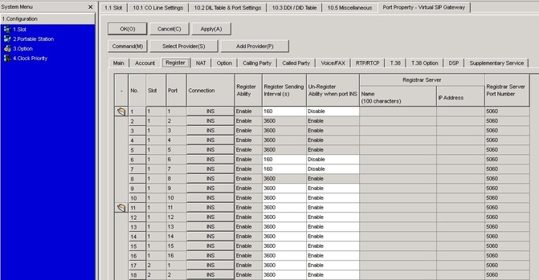

--- 
template: equipment.jade
title: 1
order: 10
---

## Настройка внешнего SIP транка в Panasonic TDE-200
Заходим в основной пункт меню 1.Slot

Выбираем IPCMPR Virtual Slot

Перед Вами отобразится набор имеющихся виртуальных плат. V-SipGW16 — платы с внешними транками, VSIPEXT32 — платы с SIP учетками для регистрации на них конечного VOIP оборудования. У Вас есть возможность занять все слоты виртуальными платами, но учтите, количество настраиваемых транков определяется наличием соответствующих лицензий.

Наводим курсор на плату V-SIPGW16, появляется всплывающее меню. Выбираем пункт Port Property.

Slot — номер виртуальной платы.

Port — номер порта в плате. Данная плата имеет 16 портов(что отображается в ее наименовании V-SIPGW16).

Connection — состояние транка. OUS — отключен, INS — включен и в рабочем состоянии, Fault — включен, но по каким то причинам регистрация не прошла.

Channel Attribute. Basic channel — непосредственно транк, Additional channel for — дополнительная линия для транка. Да, в панасонике один канал транка — одна лицензия.

Provider Name, Name, Subscriber number — можно вбить произвольные значения, либо оставить пустыми. Служат для описания.

Ip Address — IP адрес сервера регистрации. ДНС имена вбить не позволяет.

Sip server port number — порт сервера регистрации, куда будут отправляться Sip запросы. в 95% случаях используется по умолчанию 5060.

После внесения настроек применяем кнопкой Apply(состояние оставляем OUS, включенный транк не позволяет изменять конфигурацию), переходим на следующую вкладку Account.

 

User Name и Authentication ID — сюда вбиваем предоставленный оператором SIP логин.

Authentication Password — Пароль SIP учетки.

Порты, которые работают как доп. линии, настраивать не надо.

Нажимаем Apply и переходим на вкладку Register.

Register Ability — собственно, посылка SIP запросов Register, должна быть включена(Enabled)

Register Sending Interval — Как часто АТС будет посылать запросы на регистрацию. По умолчанию 3600 сек. (1 час). Настраивается в зависимости от состояние LAN\интернет канала. Если по каким то причинам регистрация будет периодически теряться, есть смысл сделать значение поменьше(крайне не рекомендуется меньше 60 сек.!, из-за некоторых особенностей работы SIP протокола может привести к проблемам)

Un-Register Ability when port INS — на портах с транками отключить(disable), на портах с доп. линиями не имеет значения.

Жмем Apply.

Собственно, базовые настройки транка на этом закончены. В столбце Connection(неважно какой вкладки) меняем значение OUS на INS. В случае отображения INS — регистрация успешно прошла, в случае Fault — придется искать причину, по которой регистрация не прошла.