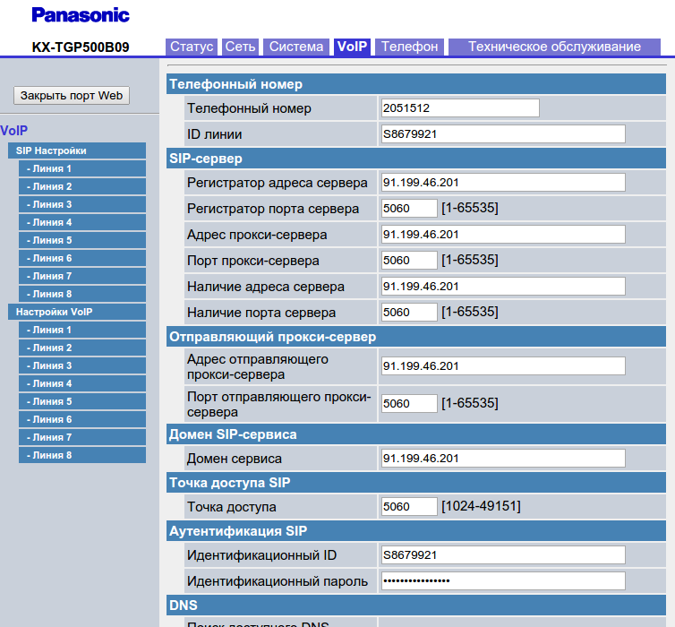
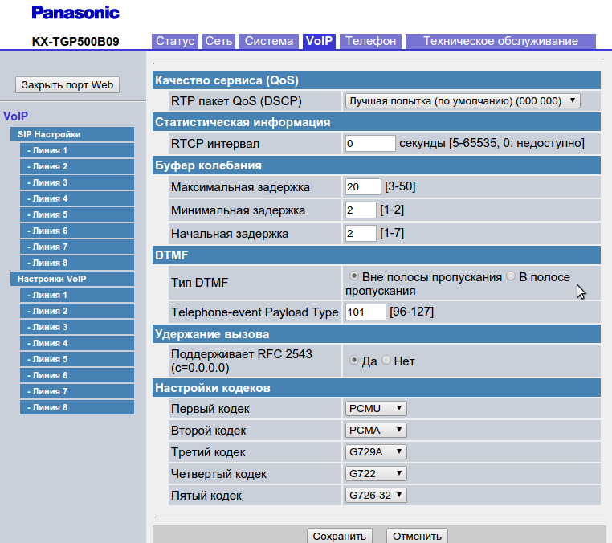
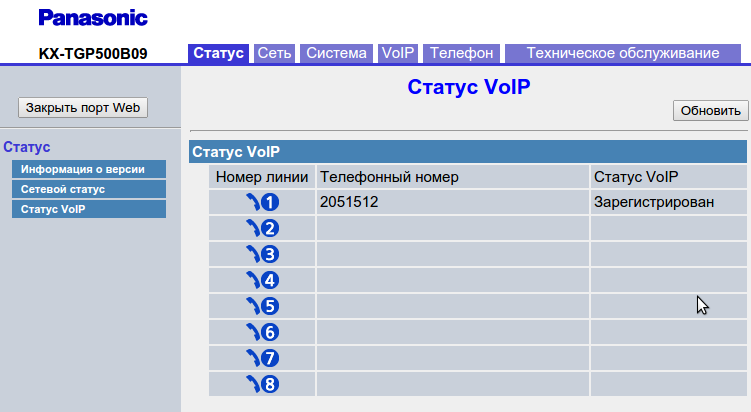
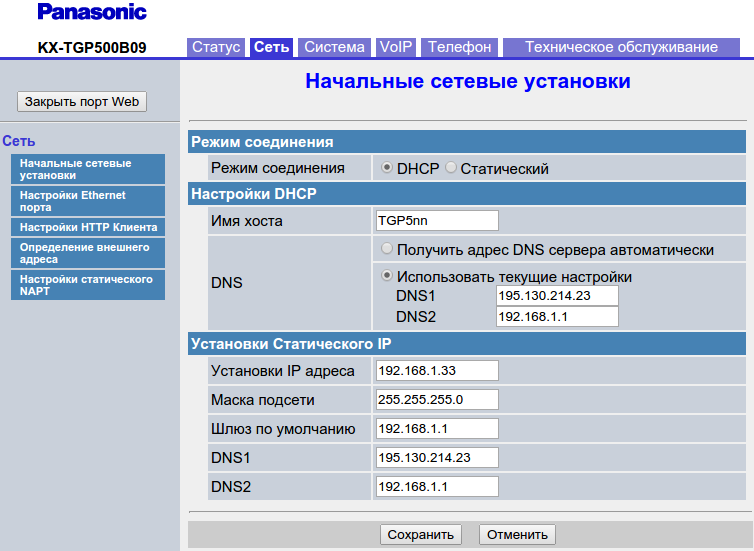
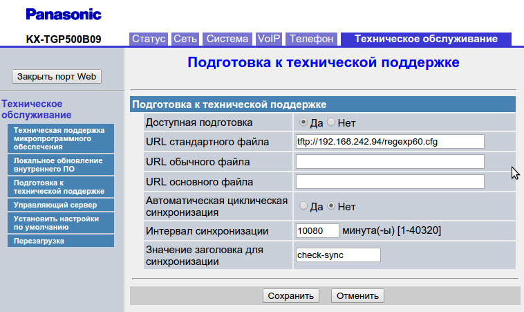
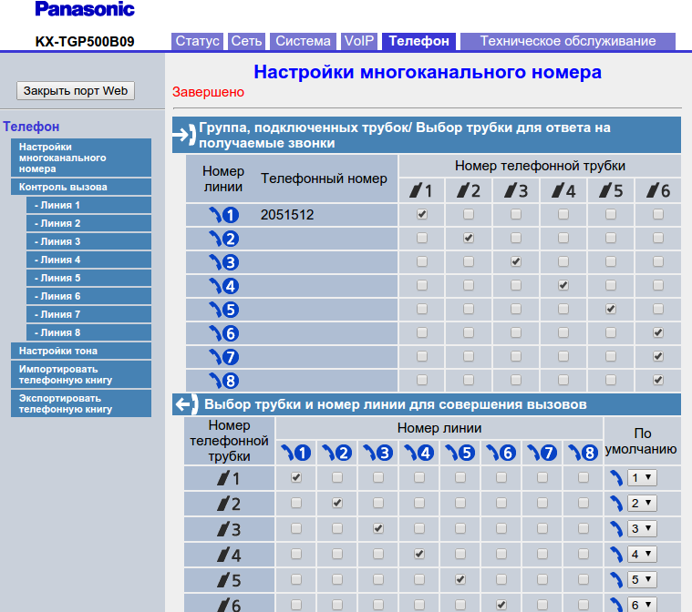

--- 
template: equipment.jade
title: 1
order: 10
---

## Настройка SIP-телефона Panasonic KX-TGP500

Настройка беспроводного SIP-телефона Panasonic KX-TGP500

1. Подключаем базу к локальной сети и сети питания.

2. Обязательно на трубке нужно активировать веб – интерфейс. Иначе зайти в настройки базы через браузер не получится.  «Меню» – «Сервис IP» – «Настройки сети» – «Встрон. Web» – «Вкл».
Внимание: Веб-интерфейс устройства снова закрывается через определенное время.

3. Откройте веб-браузер и в адресной строке введите высветившийся на дисплее трубки IP-адрес. Введите в поле логин «admin» и в поле пароль «adminpass», затем нажмите «ОК».

4. Выберите вкладку «VOIP» и выберите в поле «SIP Настройка» необходимую линию.
Введите в поле «Телефонный номер», номер который привязан к учетной записи. В поля «ID-линии», «Идентификационный ID» SIP логин учетной записи. Введите в поле «Идентификационный пароль» пароль к SIP учетной записи. Введите в поля «Регистратор адреса сервера», «Адрес отправляющего прокси-сервера», «Домен сервиса» необходимый сервер регистрации
Нажмите кнопку «Сохранить».

5. Теперь необходимо выбрать в поле «Настройка VOIP» соответствующую линию и выставить нужный приоритет голосовых кодеков. (Рис. 2)

6. Статус регистрации можно посмотреть во вкладке «Статус» — Статус VoIP. (Рис. 3)

7. По умолчанию SIP-телефон получает IP-адрес по DHCP, если необходимо указать статический IP-адрес, то необходимо перейти во вкладку сеть и прописать нужные данные. (Рис. 4)

8. Для того что бы отключить функцию Call Waiting (прием второго вызова во время разговора) необходимо сделать следующее:

8.1 Если телефон имеет доступ в сеть Интернет задача облегчается и можно воспользоваться нашим http сервером, если доступа нет, переходим к пункту 8.2.

В данном случае доступ к сети Интернет есть и для настройки остается только перейти во вкладку «Техническое обслуживание» — «Подготовка к технической поддержке» и в строчке «URL стандартного файла» указать путь до соответствующего файла конфигурации:

Нажимаем кнопку сохранить (Рис. 5). После этого над заголовком «Подготовка к технической поддержке» должна появиться красная надпись – «Завершено».

8.2 Если доступа к сети Интернет нет необходимо установить и запустить TFTP сервер, пример описан в пункте в пункте 10. На сервере разместим конфигурационный файл, доступный по ссылке ниже:

[Сохранить файл для TGP500](tgppanas.txt)

[Сохранить файл для TGP500+rtcp](tgppanasrtcp.txt)

[Сохранить файл для TGP600](tgppanas600.txt)

[panas_2ports](panas_2ports.txt)

[Сохранить файл для TGP500 v2](tgppanas2.txt)

[configtgpregexp15](configtgpregexp15.sys)

[configtgpsubs](configtgpsubs.sys)

После чего переходим во вкладку «Техническое обслуживание» — «Подготовка к технической поддержке» и в строчке «URL стандартного файла» прописывает путь до файла конфигурации, который находится на tftp-сервере. Путь к файлу будет примерно таким:
tftp://ip-сервера/tgppanas.txt
tftp://ip-сервера/tgppanas600.txt
Нажимаем кнопку сохранить (Рис. 5). После этого над заголовком «Подготовка к технической поддержке» должна появиться красная надпись – «Завершено».

Дополнительно:
В конфигурационный файл так же добавлены рекомендуемые параметры для корректной работы телефона за NAT:

> PORT_PUNCH_INTVL_1...8 - время между отправкой пакетов Keep Alive

> REG_EXPIRE_TIME_1...8 - продолжительность регистрации

> SIP_DETECT_SSAF_1...8 - ограничение трафика с не указанных серверов
 

9. К данному телефону можно привязать дополнительную трубку Panasonic KX-TPA50.
Для того что бы привязать трубку необходимо сделать следующее:
1) На Базовом блоке нажать и удерживать кнопку около 4 секунд, пока индикатор на базе не начнет мигать красным светом.
Если все зарегистрированные трубки начинают звонить, нажмите эту же кнопку для прекращения звонков. Затем повторите этот шаг.
Следующий шаг должен быть завершен в течении 90 секунд.
2) На трубке заходим в меню, выбираем регистрацию трубки, нажимаем кнопку «ОК». Затем появится на экране сообщение «введите PIN базы», PIN-код базы по умолчанию 0000, после этого нажимаем «ОК» и должен прозвучать длинный звуковой сигнал. Это означает что трубка зарегистрировалась на базе.
2. Учетная запись для дополнительной трубки настраивается аналогично первой, только необходимо выбрать во вкладке «VOIP» — «SIP Настройка» другую линию. Так же, для корректной работы входящей, исходящей связи, переходим во вкладку «Телефон» и привязываем к каждой трубке свою линию подобным образом и нажимаем сохранить (Рис. 6).

 

10. Поднятие TFTP сервера на Windows.

В качестве windows сервера советуем tftpd. Скачать можно здесь http://tftpd32.jounin.net/tftpd32_download.html

Выбираем разрядность системы(32 или 64), для разового использования предпочтительнее скачать standart edition, если планируется использовать сервер постоянно можно установить его как службу(service edition).

Установка проста — устанавливаем без изменений настроек. Запускаем. Папка с файлами сервера указана в Current Directory, по умолчанию выставлена системная папка, куда установлен tftp(Program Files), можно сменить на другую, так как могут возникнуть проблемы с правами доступа.

Как проверить работу:

Запускаем cmd.exe и выполняем команду: tftp 192.168.1.10 GET имя_файла.txt

Тестовый файл необходимо заранее поместить в Current Directory. Если TFTP клиент не установлен, его можно установить в компонентах системы.

[TGP UT](tgppanasut123.sys)