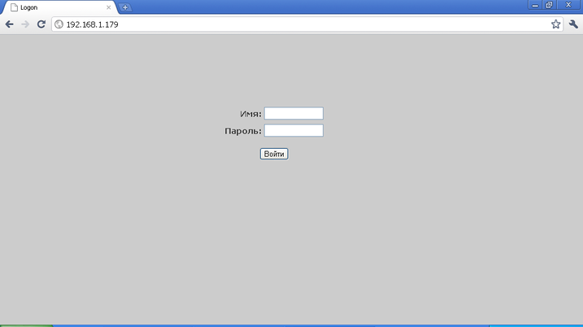
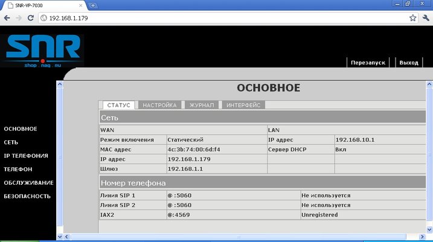
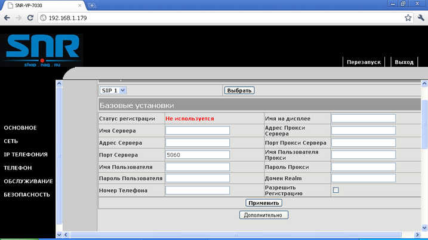
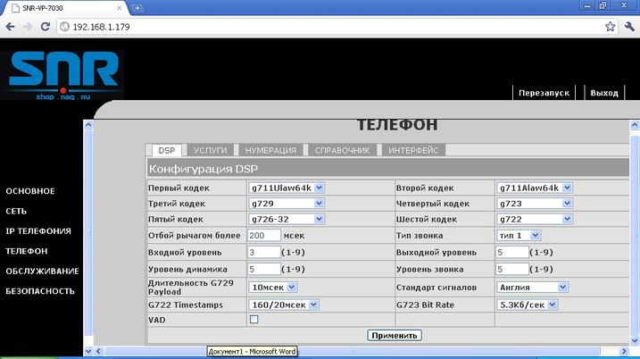

--- 
template: equipment.jade
title: 1
order: 10
---

## Настройка SIP телефона SNR VP7030
Настройка этого телефона осуществляется либо через web-интерфейс или из меню самого телефона.

Для начала надо зайти в меню телефона, нажав кнопку Menu. Затем выбрать пункт «Дополнительно». Для подтверждения нажмите «Ввод» Попросят ввести пароль, пароль – «123» (по умолчанию). Затем выбираем «Сеть->Режим сети». По умолчанию стоит DHCP, надо изменить на статический режим. Нажимаем «Изменить» и джойстиком влево выбираем режим «Статический». Нажимаем «Сохранить».

По умолчанию статический IP-адрес устройства на обоих интерфейсах (WAN, LAN) – 192.168.1.179. На компьютере выставляем соответственно IP-адрес из этой подсети, то есть вида 192.168.1.ХХХ, где ХХХ – число от 1 до 255, исключая 179. Форма авторизации выглядит следующим образом(Рисунок 1):

Имя по умолчанию – admin, пароль – admin.

После успешной авторизации увидим следующее окно(Рисунок 2):

Здесь нам понадобятся вкладки «Сеть», «IP-телефония» и «Телефон».

Заходим во вкладку «Сеть» и устанавливаем необходимые параметры сети (IP-адрес телефона и т.д.). После всех изменений нажимаем «Применить».

Затем заходим во вкладку «IP-телефония». Увидим следующее окно(Рисунок 3):

В параметре «Адрес сервера» указываем адрес SIP-сервера.

В параметре «Имя сервера» можно указать так же IP-адрес сервера или написать Mobilon.

Порт сервера оставляем 5060.

Имя пользователя, номер телефона – логин учетной записи.

Имя на дисплее – вводим любое,  можно ввести логин.

Пароль пользователя – пароль учетной записи.

Остальные поля не заполняем, ОБЯЗАТЕЛЬНО ставим галочку «Разрешить регистрацию».

Нажимаем кнопку «Применить».

После этого заходим во вкладку «Телефон». Увидим следующее окно(Рисунок 4):

Выставляем кодеки. Стандарт сигналов выбираем «Россия». Затем нажимаем «Применить».

Телефон настроен, статус регистрации отображается во вкладке IP-Телефония.