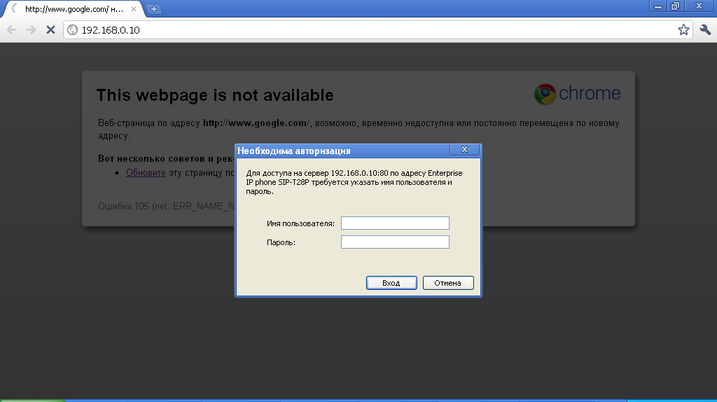
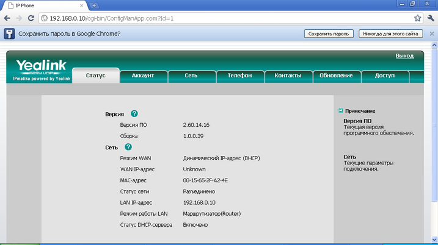
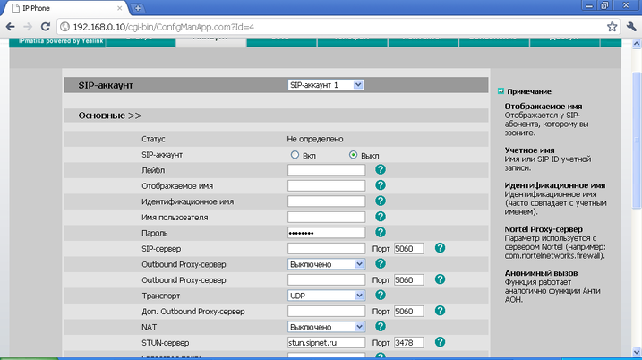
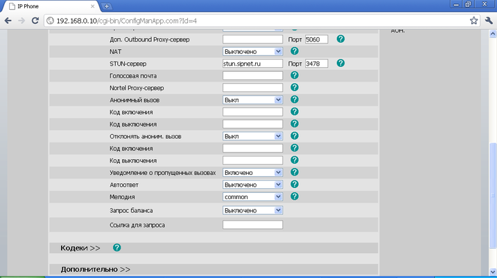
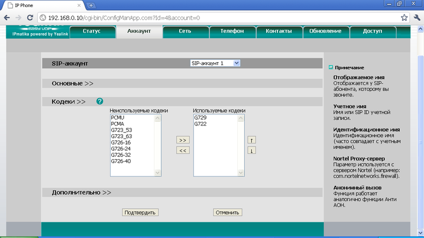
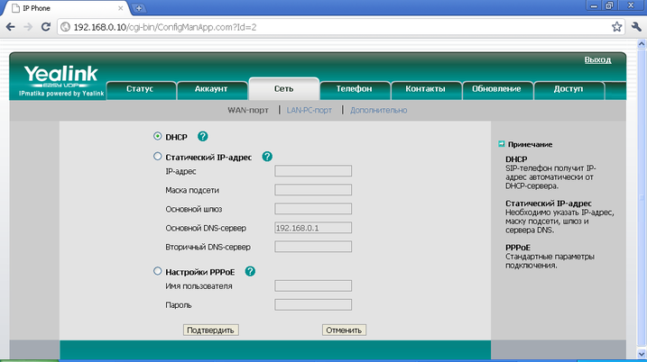

--- 
template: equipment.jade
title: 1
order: 10
---

## Настройка SIP телефона Yealink T28P

Настройка этого телефона осуществляется либо через web-интерфейс или из меню самого телефона.

Для установки IP-адреса на LAN-порту (PC), необходимо нажать:

Меню –> Настройки –> Дополнительные настройки –> Вводим пароль (стандартный пароль — admin). –> Сеть –> LAN  и ставим в данном пункте параметр Шлюз. При этом предлагается ввести IP-адрес и маску. Вводим IP-адрес, запоминаем его и в адресной строке браузера пишем назначенный телефону IP-адрес. При этом видим следующее окно авторизации:

Вводим логин и пароль (по умолчанию логин admin и пароль admin).

После успешной авторизации увидим следующее окно:

Заходим во вкладку «Аккаунт», здесь заполняем параметры SIP . Отмечаем SIP-аккаунт «Вкл.»:

Заполняем поля «Отображаемое имя», «Идентификационное имя», «Имя пользователя», «Пароль». В первых трех строках – логин учетной записи, в последней графе – пароль учетной записи. В строке SIP-сервер указываем IP-адрес сервера регистрации или его доменное имя.

Затем заходим в подпункт «Кодеки» и увидим следующее окно:

Здесь заполняем список «Используемые кодеки» путем перемещения из неиспользуемых кодеков.

После всех изменений нажимаем кнопку «Подтвердить».

Затем заходим во вкладку «Сеть» и здесь настраиваем параметры IP-сети для телефона (IP-адрес, маска, шлюз, DNS-сервера):

После всех изменений нажимаем кнопку «Подтвердить».

Основная настройка закончена, можно подключать телефон. Статус регистрации можно посмотреть во вкладке «Аккаунт».