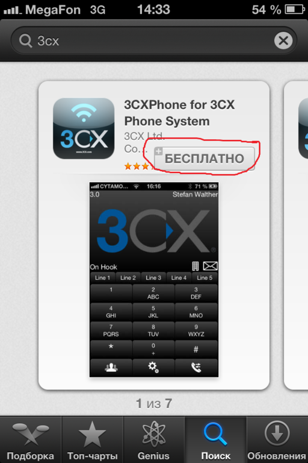
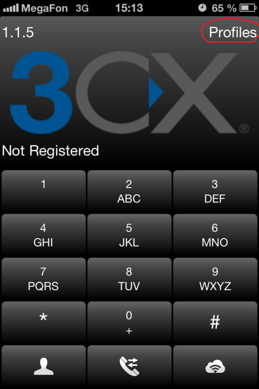
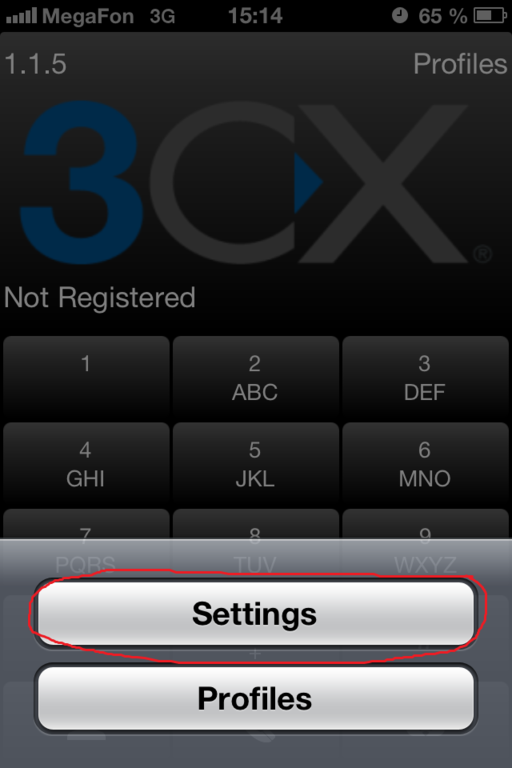
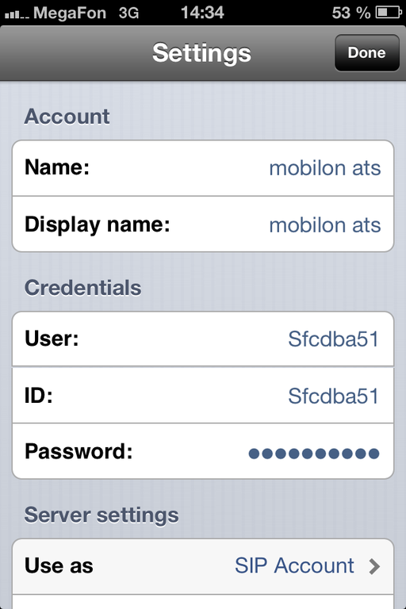
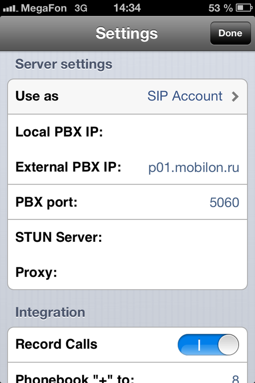
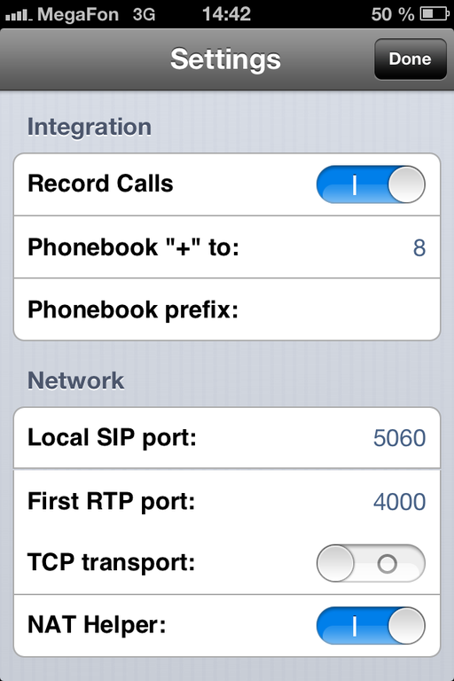
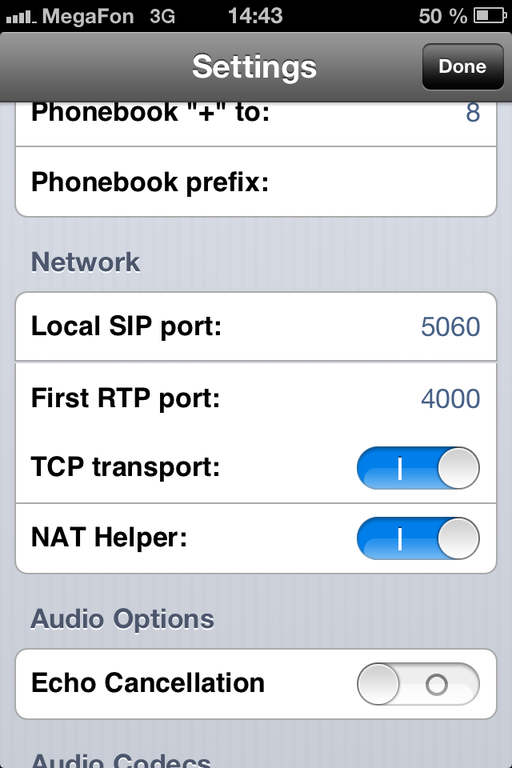
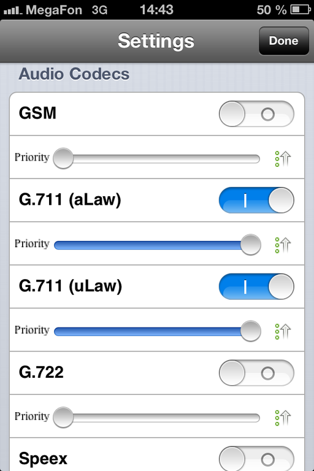
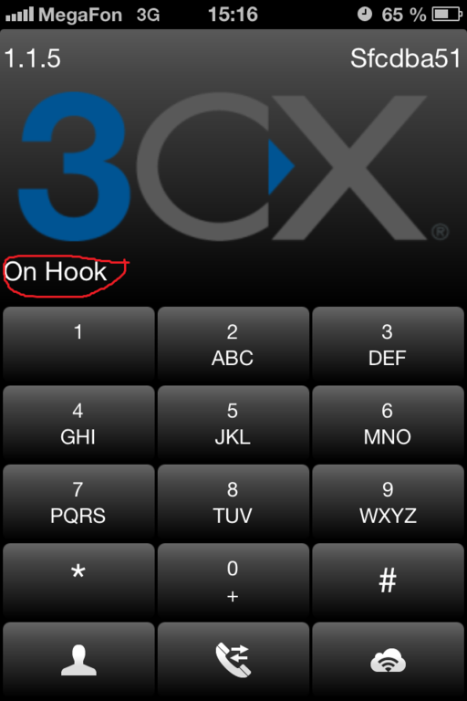

--- 
template: equipment.jade
title: 1
order: 10
---

## Настройка 3CXPhone для IOS (iPhone)
Набираем в «appstore» в поиске 3cx, устанавливаем его. 

Нажимаем «profiles» 

Выбираем «settings» 

В поля «name», «display mane», «user», «id» вводим логин, в поле «password» вводим пароль 

В поле «server settings» должно быть указано «sip account». В поле «external pbx ip» вводим адрес сервера. 

Далее настройки можно оставить без изменений 

В настройках аудио кодеков, необходимо отключить все, кроме «alaw», «ulaw». Их ползунки должны быть вытянуты в максимальный приоритет.   

После того как примените настройки должна появиться надпись «on hook». Это означает, что учётная запись зарегистрировалась на сервере и можно совершать звонки. 

