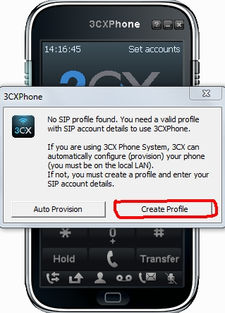
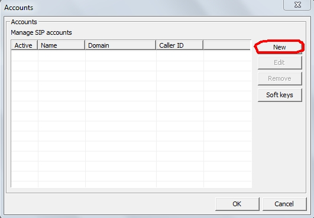
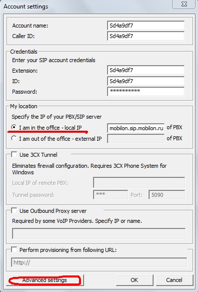
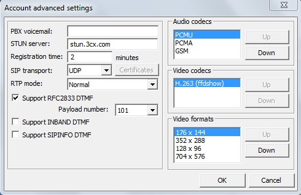
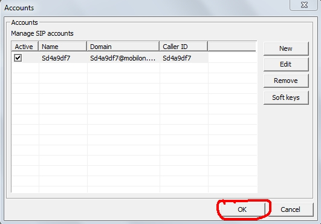
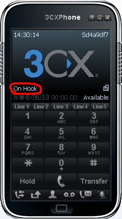

--- 
template: equipment.jade
title: 1
order: 10
---

## Настройка 3CXPhone для Windows
Для установки приложения необходимо скачать установочный пакет по ссылке. http://www.3cx.com/downloads/3CXPhone6.msi

Запускаем программу. При первом запуске появляется сообщение о создании аккаунта. Нажимаем «create profile» 

Жмём «new» 

В поля «account name», «callerid», «extension», «id» вводим логин. В поле «password» вводим пароль. В пунтке «my location» выбираем «I am in the office – local ip» 

Далее нажимаем «advanced settings» (Рис. 3), затем в параметре «audio codecs» выставляем первыми по приоритету кодеки «pcmu» и «pcma». 

В списке аккаунтов появится введённая учётная запись, остаётся только нажать кнопку «ok».

Надпись «on hook» говорит о том, что учётная запись зарегистрировалась и можно совершать звонки. 

Внимание! Данный софтфон не поддерживает кодек G.729, поэтому пригоден для использования только клиентами с тарифами класса «премиум», которые используют кодек G.711.