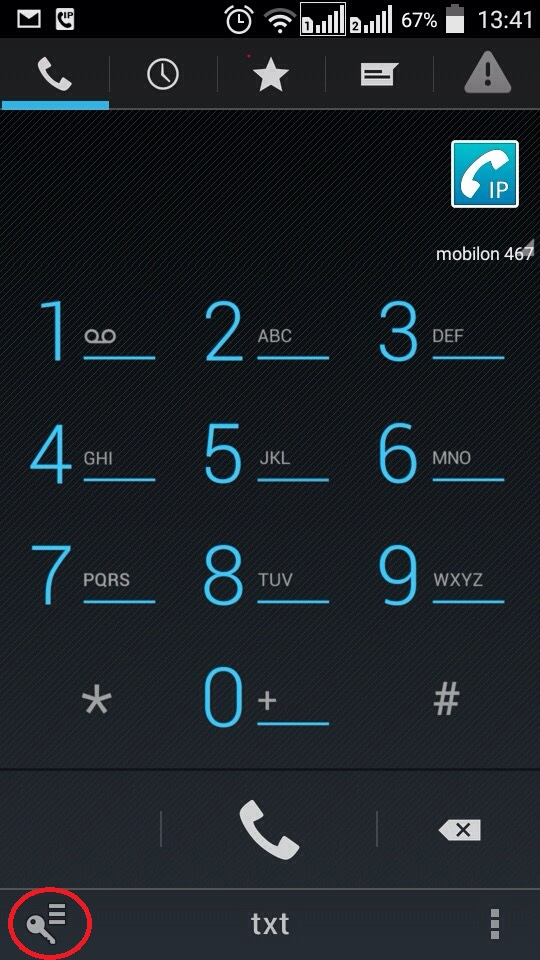
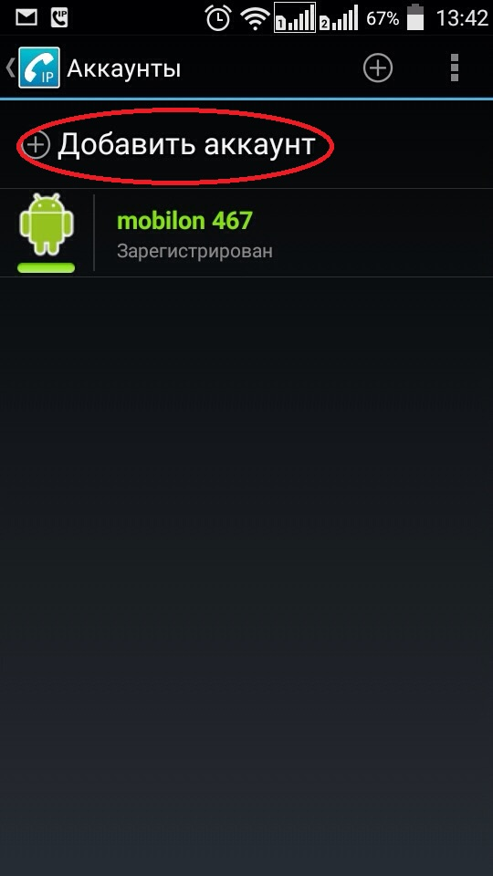
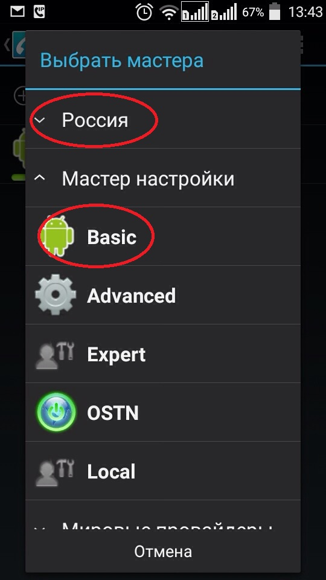
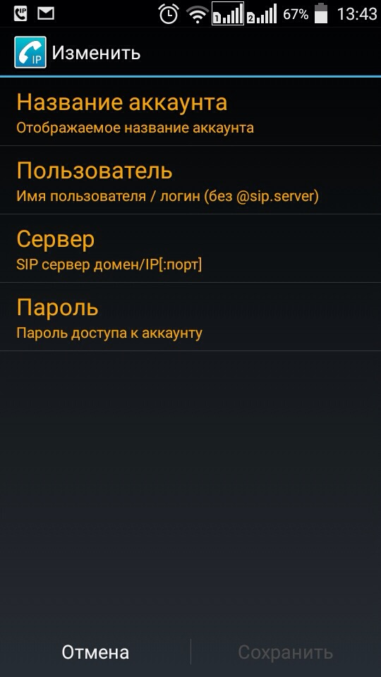
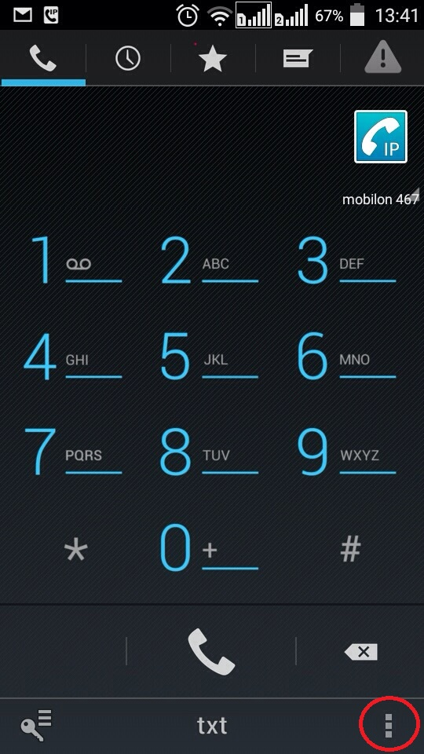
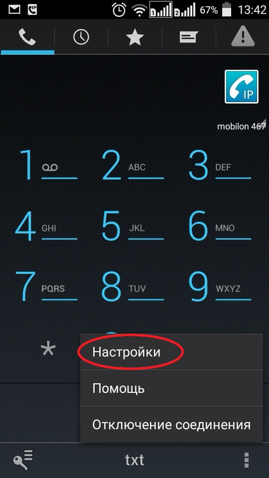
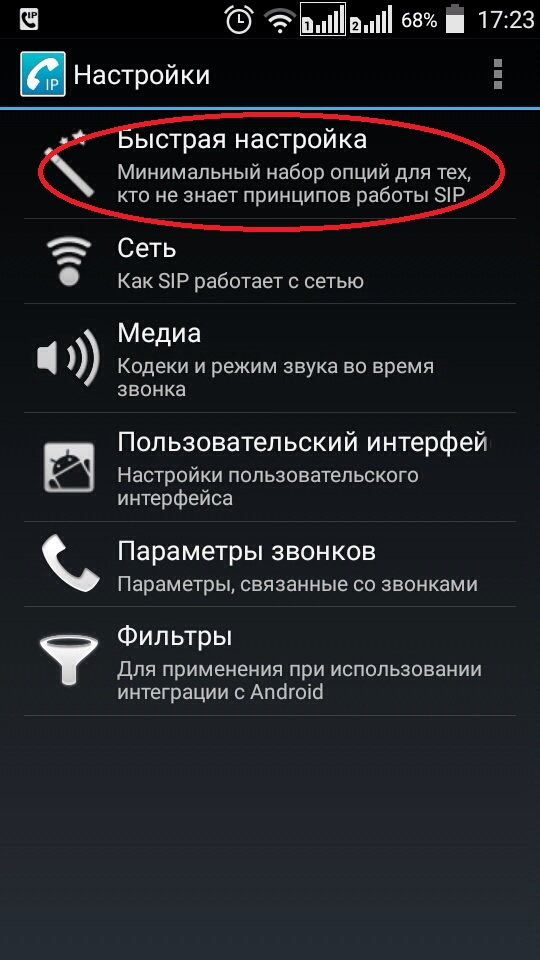
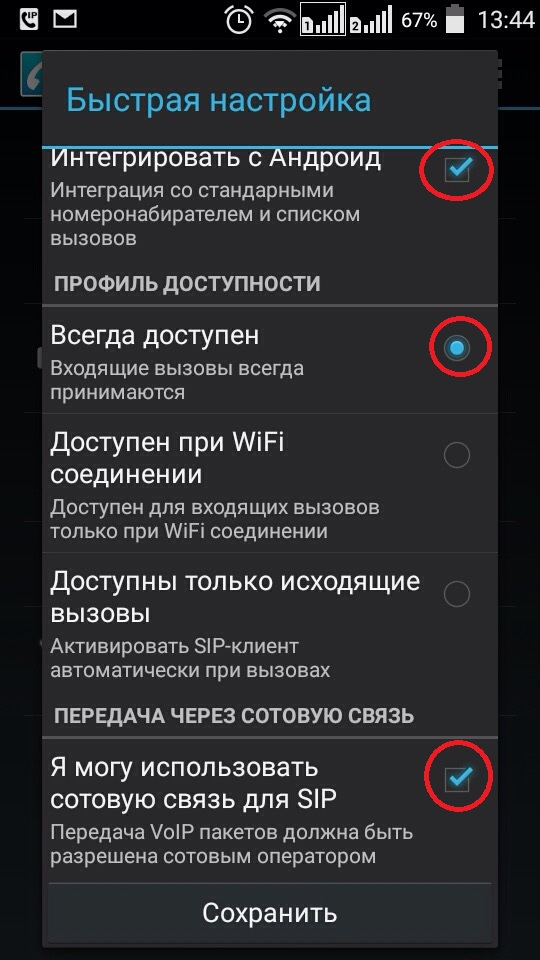

--- 
template: equipment.jade
title: 1
order: 10
---

## Настройка CSIPSimple для Android

Инструкция по настройке софтфона CSIPSimple для Android

Необходимо скачать приложение в Google play. Для этого нужно вбить в строке поиска название csipsimple:
Установить. После запуска приложения необходимо зайти в настройки:

 

Далее перейти в Аккаунты и нажать кнопку Добавить аккаунт:

В открывшемся списке необходимо свернуть пункт Россия, а затем нажать Basic. Программа предложит ввести учётные данные:

В поле Название можно вбить Мобилон, в поле Пользователь необходимо указать SIP-логин, в поле Сервер указать адрес сервера, а в поле Пароль указать пароль. Затем нажать кнопку Сохранить.

Софтфон попробует зарегистрироваться. В случае удачной регистрации в верхнем правом углу появится синяя иконка с трубкой. Далее необходимо нажать нижнюю правую кнопку и там выбрать Настройки:

Далее перейти в Быстрая настройка и там необходимо выставить галочки Интегрировать с Андроид, Всегда доступен, Я могу использовать сотовую связь для SIP:

Затем нажать кнопку сохранить. Софтфон готов к работе.