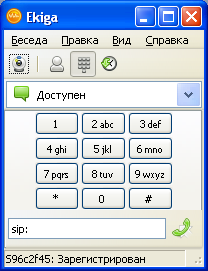
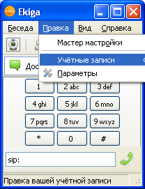
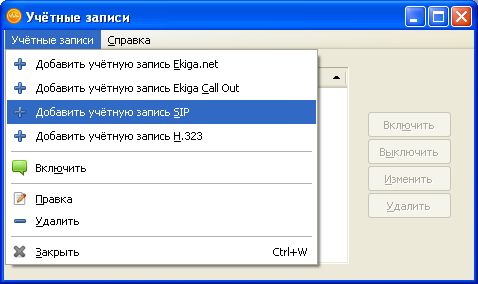
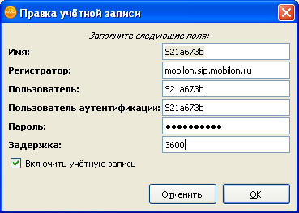
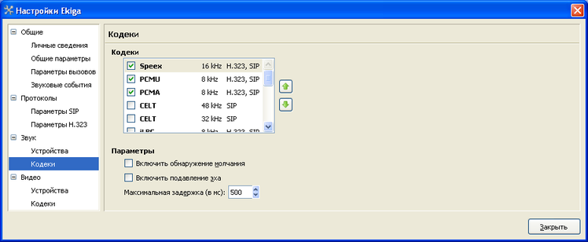
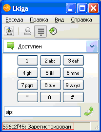

--- 
template: equipment.jade
title: 1
order: 10
---

## Настройка софтфона Ekiga
Для установки приложения необходимо скачать установочный пакет по ссылке http://www.ekiga.org/download-ekiga-binaries-or-source-code

Далее производится процесс установки. Само приложение при запуске выглядит следующим образом 

Для настройки учтенной записи необходимо зайти в меню «Правка->Учетные записи» (Рис. 2), либо нажать сочетание клавиш Ctrl+E

Мы попадаем в меню настройки учетных записей. Далее необходимо пройти в меню «Учетные записи -> Добавить учетную запись SIP» 

Для настройки учетной записи необходимо заполнить следующие поля:

- Имя: имя учетной записи, можно выставить произвольным;

- Регистратор: IP-адрес или доменное имя сервера;

- Пользователь: логин учетной записи;

- Пользователь аутентификации: логин учетной записи;

- Пароль: пароль учетной записи

- Задержка: здесь необходимо указать время перерегистрации, можно оставить стандартное значение, указывается в секундах.

Для настройки так же необходимо проверить список подключенных кодеков, делается это в разделе «Правка-> Параметры -> Звук -> Кодеки».  

Внимание! Данный софтфон не поддерживает кодек G.729, поэтому пригоден для использования только клиентами с тарифами класса «премиум», которые используют кодек G.711.

В случае успешной регистрации интерфейс программного телефона будет выглядеть следующим образом:

