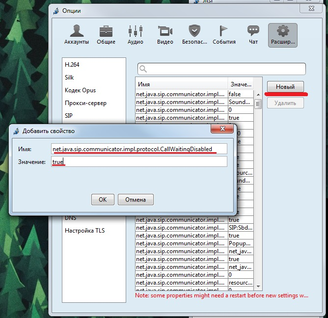

--- 
template: equipment.jade
title: 1
order: 10
---

## Настройка софтфона Jitsi

Скачать программу можно на официальном сайте https://jitsi.org/Main/Download

При первом запуске софтфона Jitsi вы увидите окно программы. Для настройки SIP аккаунта необходимо нажать «Файл»  — «Добавить новую учётную запись…»

Далее в выпадающем списке выбираем «SIP», как показано на рисунке ниже

Далее в поле «Идентификатор SIP» вводим ваш SIP-логин затем симфол @ и ваш сервер регистрации как показано на рисунке ниже. В поле «пароль» вводим ваш пароль.

Далее в основном окне программы (рисунок 1) нажимаем «Инструменты» — «Опции», переходим на вкладку «Аудио», выбираем вкладку «кодеки» и оставляем те кодеки, которые указаны на рисунке 4.

Далее выбираем значок «Расшир…», ищем вкладку DNS  и вбиваем Имя DNS-сервера и IP-адрес DNS-сервера как на рисунке 5

Пришло время отключить опцию Call-Waiting. Для этого всё там же, в расширенных настройках, выбираем «Редактор свойств», соглашаемся с условиями(рисунок 6)

Жмём кнопку «новый», в поле «Имя»  и вводим следующую строчку        net.java.sip.communicator.impl.protocol.CallWaitingDisabled

, а в поле «Значение» прописываем         true        , всё как на рисунке 7. Жмём «ОК»

Далее во вкладке SIP указываем SIP порты как на рисунке 8

Далее заходим в «Аккаунты», выбираем ваш аккаунт (рисунок 9), жмём «Правка»

Во вкладке «Кодеки» выставляем кодеки как на рисунке 10

Переходим на вкладку «Соединение» и убеждаемся, что ваши настройки те же, что и на рисунке 11

Во вкладке «присутствие» выставляем значения «период опроса контактов вне сети» и «продолжительность подписки» 30 и 200 соответственно, как на рисунке 12

И в заключении настраиваем ваш микрофон во вкладке «Аудио»

