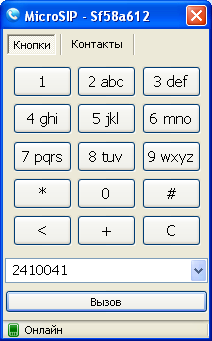
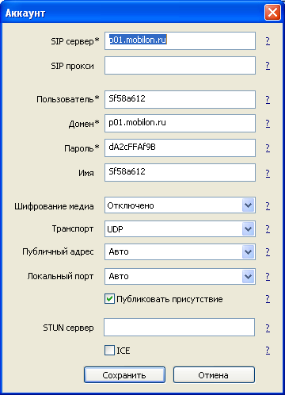
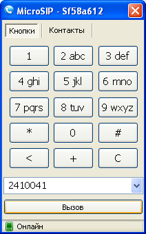

--- 
template: equipment.jade
title: 1
order: 10
---

## Настройка софтфона MicroSIP

Скачать данную программу можно по адресу http://www.microsip.org.

Окно программы выглядит следующим образом:

Для настройки аккаунта необходимо нажать правой кнопкой по значку MicroSIP и зайти в меню «Аккаунт». Данные в этих настройках должны выглядеть следующим образом:

Настройки имеют следующее назначение:

- SIP-сервер – IP-адрес или доменное имя SIP-сервера

- Пользователь – имя учетной записи

- Домен — IP-адрес или доменное имя SIP-сервера

- Пароль – пароль учетной записи

- Имя – имя учетной записи

- Транспорт – UDP

Если всё настроено корректно, то в нижней части окна программы Вы увидите надпись «Онлайн»:

