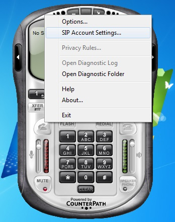
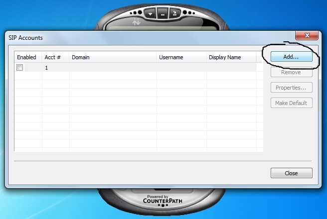
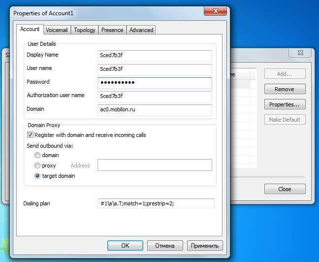
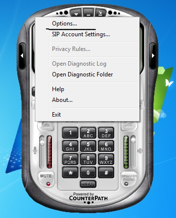
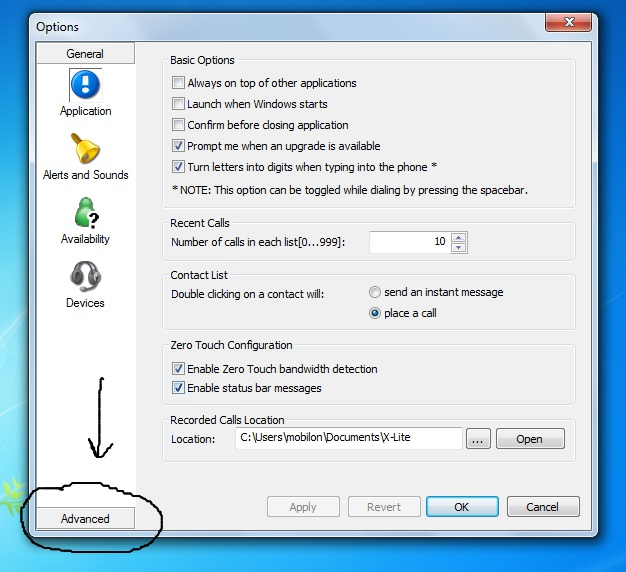
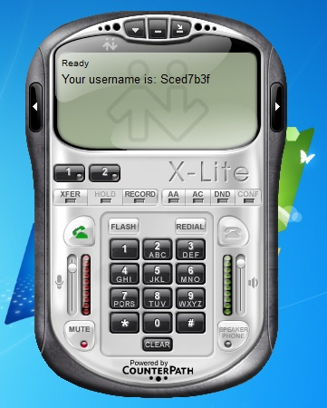

--- 
template: equipment.jade
title: 1
order: 10
---

## Настройка X-Lite 3.0

При первом запуске софтфона X-Lite 3.0 вы увидите окно настройки SIP-аккаунтов. Если окно, по каким либо причинам не открылось, щелкайте правой кнопкой мыши по окошку софтфона и выберите в выпавшем меню «SIP Account Settings». 

В появившемся окошке вам необходимо создать новый аккаунт для подключения к SIP-серверу компании «Мобилон», для этого нажмите кнопку «Add»

В появившемся окошке, в поля Username и Authorizationusername, введите SIP-логин, в поле Password — пароль и в поле Domain — адрес SIP-сервера. Остальные галочки должны быть выставлены, как на скриншоте, как правило, по умолчанию они выставлены верно. В поле Displayname можно ввести, что угодно, оно отвечает за отображаемое имя данного аккаунта на вашем компьютере. В других вкладках данного окна нет необходимости изменять настройки, поэтому нажимайте «ОК», окно настройки аккаунтов так же закройте с помощью кнопки «ОК». 

Далее необходимо опять нажать правой кнопкой на окошко софтфона и выбрать в меню «Options».

В открывшемся окне настроек вам необходимо нажать кнопку «Advanced»

Здесь вам необходимо убедиться, что вы находитесь во вкладке «AudioCodecs», затем в колонке Enabledcodecs вам нужно оставить кодеки G711 aLaw и G711 uLaw. Вы можете переносить кодеки, выделяя их мышкой и перенося их с помощью стрелок отмеченных зеленой рамкой. Далее нажмите «ОК» и ваш софтфон должен быть готов к работе, о чем может свидетельствовать надпись «Ready» на дисплее софтфона.

Внимание! Данный софтфон не поддерживает кодек G.729, поэтому пригоден для использования только клиентами с тарифами класса «премиум», которые используют кодек G.711.