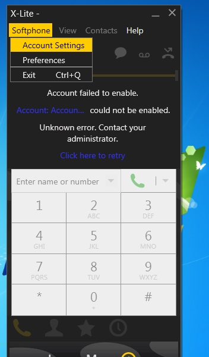
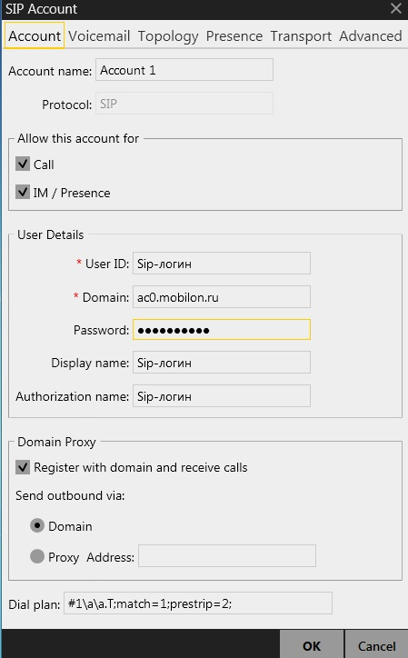
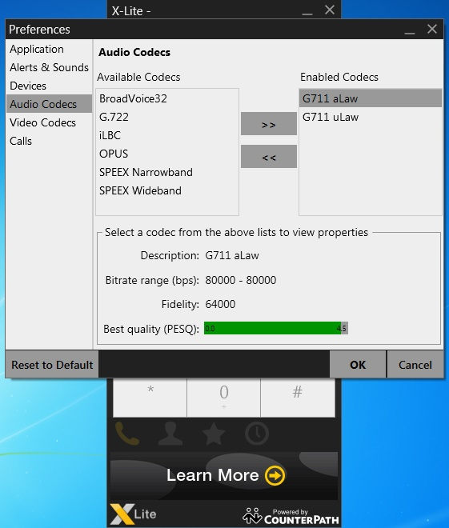
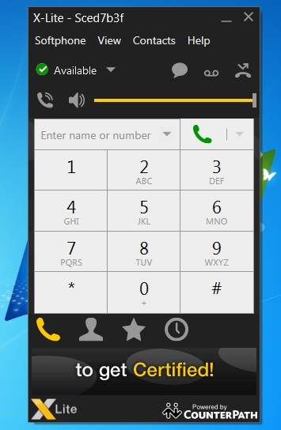

--- 
template: equipment.jade
title: 1
order: 10
---

## Настройка X-Lite 4.5

Сотфон можно скачать по следующей ссылке https://www.counterpath.com/x-lite-for-windows-download.html

При первом запуске софтфона X-Lite 4.5 вам будет необходимо настроить SIP-аккаунт. Нажмите левой кнопкой на вкладку «Softphone» — «Account Settings». 

В появившемся окошке, в поля UserID и Authorizationname, введите SIP-логин, в поле Password — пароль и в поле Domain адрес SIP-сервера. Остальные галочки должны быть выставлены, как на скриншоте, как правило, по умолчанию они выставлены верно. В поле Displayname можно ввести, что угодно, оно отвечает за отображаемое имя данного аккаунта на вашем компьютере. В других вкладках данного окна нет необходимости изменять настройки, поэтому нажимайте «ОК», окно настройки аккаунтов так же закройте с помощью кнопки «ОК».

Далее необходимо опять нажать правой кнопкой на окошко софтфона и выбрать в меню «Preferences».

Здесь вам необходимо убедиться, что вы находитесь во вкладке «AudioCodecs», затем в колонке Enabledcodecs вам нужно оставить два кодека, как на скриншоте ниже. Вы можете переносить кодеки, выделяя их мышкой и перенося их с помощью стрелок отмеченных зеленой рамкой. Далее нажмите «ОК» и ваш софтфон должен быть готов к работе, о чем может свидетельствовать надпись «Available» рядом с зеленым значком на дисплее софтфона.

Внимание! Данный софтфон не поддерживает кодек G.729, поэтому пригоден для использования только клиентами с тарифами класса «премиум», которые используют кодек G.711.