--- 
template: equipment.jade
title: 1
order: 10
---

## Настройка софтфона Zoiper на iOS(iPhone)
Загружаем Zoiper из App Store:

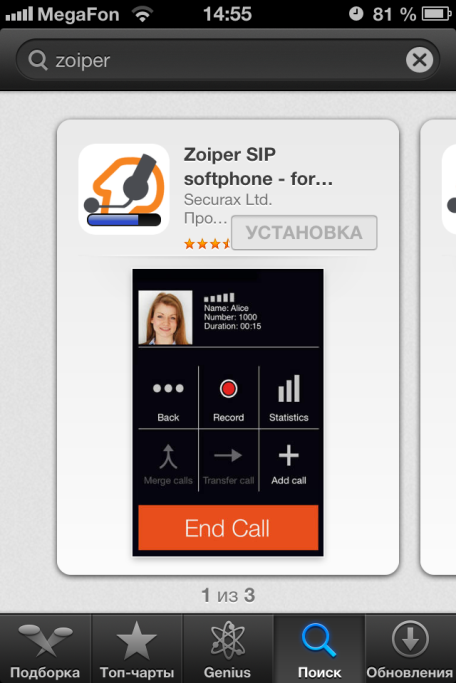

Запускаем:

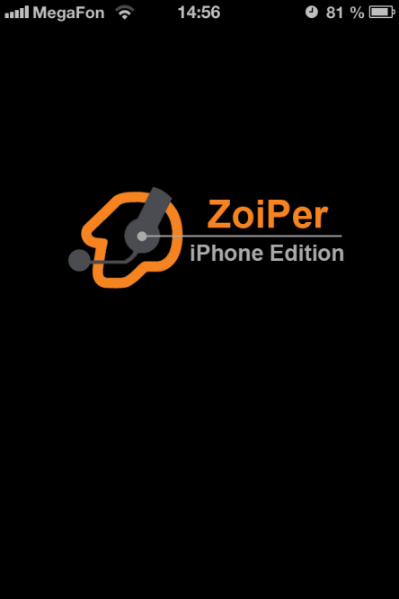

Нажимаем «Settings»:

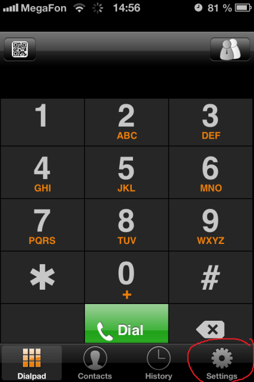

Нажимаем «Accounts»:

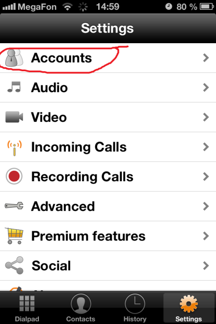

Жмём «+»:

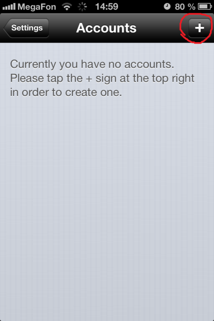

Выбираем «SIP account»:

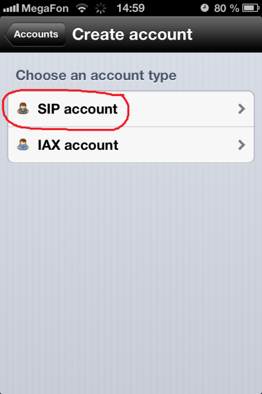

В поле «Account name» и «User name» вбиваем логин, в поле «Password» вбиваем пароль. В поле «Domain» вбиваем адрес сервера. В поле «CallerID» вбиваем номер телефона в междугороднем формате:

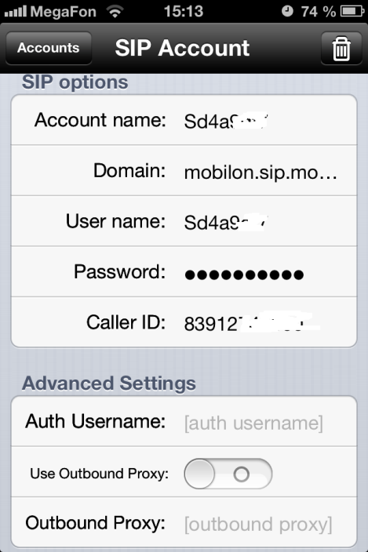

Заходим ниже в параметр «Audio codecs» и настраиваем необходимые кодеки:

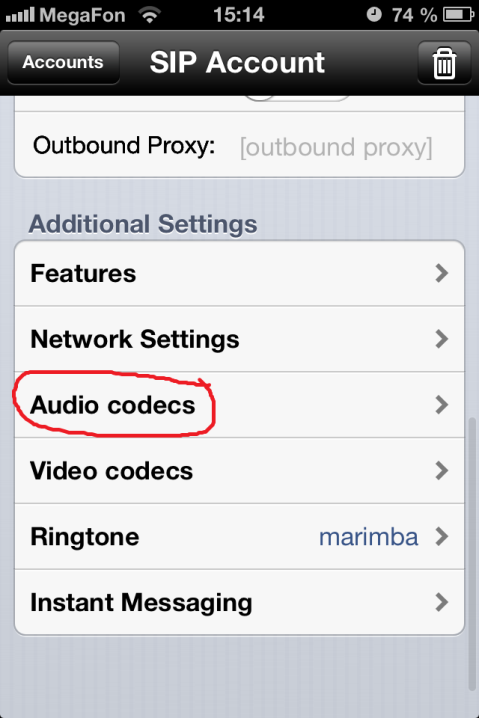
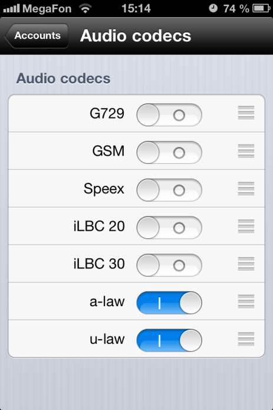

Возвращаемся назад и нажимаем кнопку «Register»:

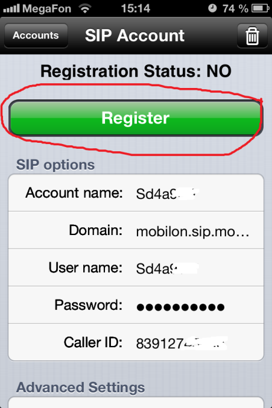0

Зеленая надпись «Ready» означает, что софтфон готов к использованию:

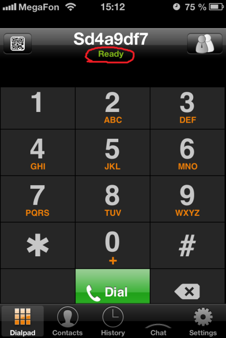