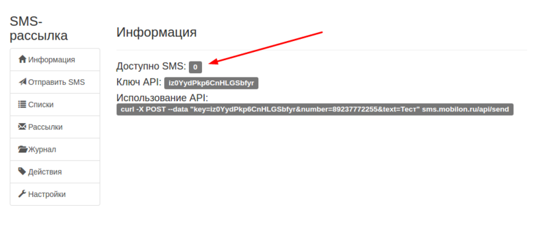

--- 
template: sms.jade
title: Справочный центр
---

## Настройка

### Основные шаги

1. После заказа услуги и подключения приложения СМС-рассылка на аккаунт клиента, необходимо предоставить пользователю доступ к приложению.

2. Необходимо проверить доступное количество СМС для отправки. На основном экране приложения - пункт "Доступно СМС"

3. В настройках должно быть указано буквенное имя отправителя.

