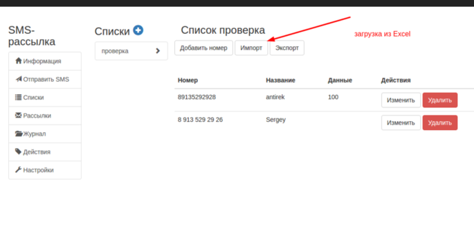
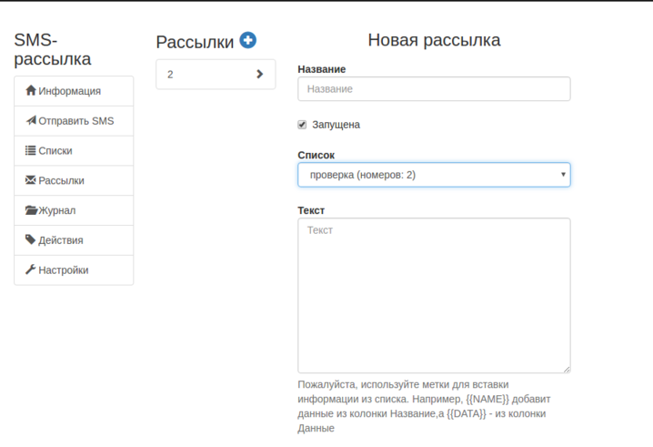

--- 
template: sms.jade
title: Рассылка СМС
order: 40
---

## Рассылка СМС

### Подготовка

Прежде чем рассылать СМС необходимо подготовить списки рассылки. Список должен содержать номера телефонов в федеральном формате. Также список может содержать имена, а также иные данные.

Перейдите в пункт "Списки". Создайте новый список. Далее вы можете добавить нужные номера по одному, используя интерфейс или загрузить списком из Excel файла. 

### Рассылка

Затем перейдите в пункт "Рассылка" и создайте задание на рассылку СМС-сообщений по списку. 

Укажите название рассылки, выберите нужный список. 

Составьте текст сообщения. 

Внимание: вы можете использовать шаблоны подстановки для вставки данных из списка. {{NAME}} добавит данные из колонки "имя", а {{DATA}} - из колонки "данные". 

Также установите галочку "Запущена" - это запустит рассылку сразу же после сохранения ее параметров. Если галочку не установить, то рассылка не будет запущена, ее можно будет отредактировать позже.

Также вы можете установить время рассылки.

