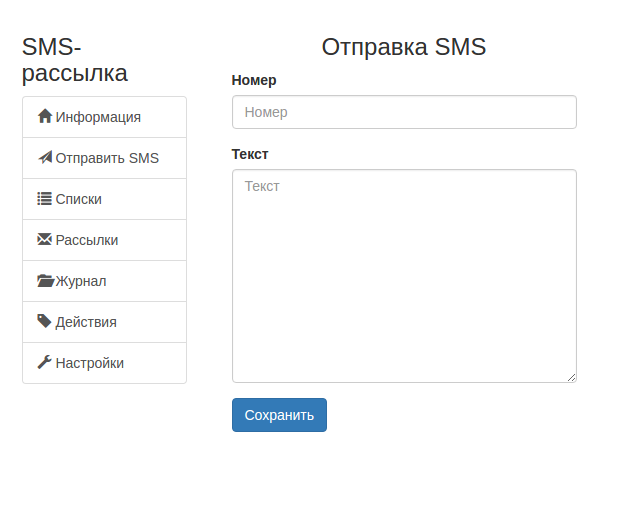

--- 
template: sms.jade
title: Справочный центр
---

## Отправка одного СМС

1. Перейдите в пункт "Отправка СМС" 

2. Введите номер и текст сообщения. Нажмите кнопку "Отправить".

Все ок! СМС отправлена.

 
### Проверка отправки 

1. Перейдите на вкладку "Журнал"

2. Найдите в списке номер, на который вы отправили СМС. Проверьте статус отправки.

### Статусы СМС

1. "Не отправлено" - СМС не отправлено. Это может быть по нескольким причинам: технические неполадки, отсутствие средств на счету клиента.

2. "Отправлено" - СМС отправлено.

3. "Доставлено" - СМС отправлено и доставлено на устройство с номером отправки.