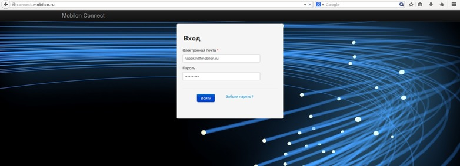
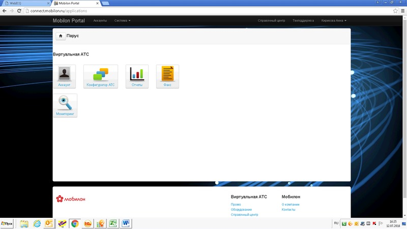
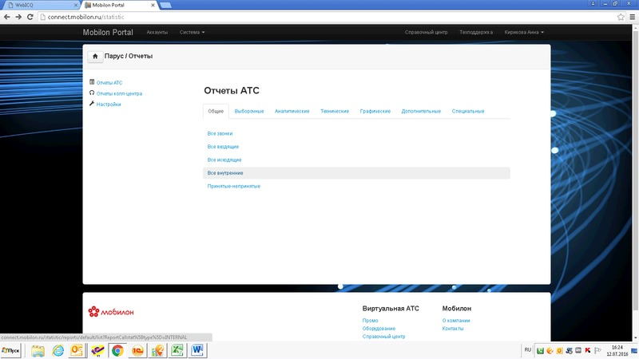
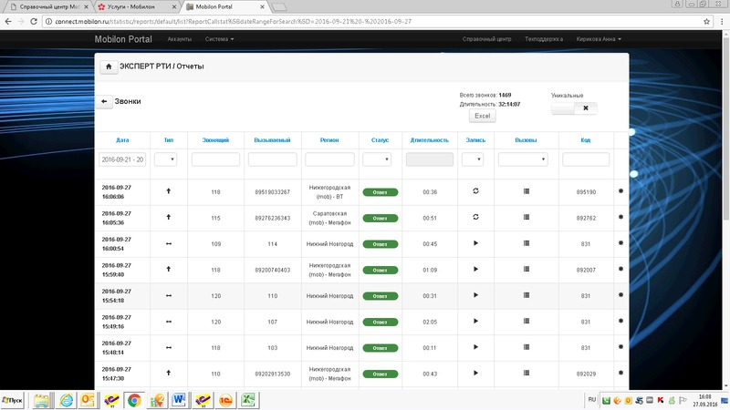
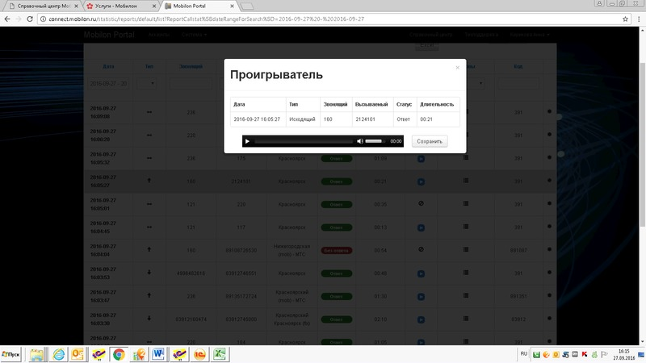

--- 
template: vpbx.jade
title: Памятка абоненту
order: 10
---

## Памятка абоненту

В Виртуальной АТС Мобилон есть много функций, которые могут быть удобны для использования каждый день: звонки между абонентами, перехваты, запись разговоров.

На этой страничке собраны наиболее часто используемые функции. Пожалуйста, ознакомьтесь : )

### Порядок приема звонков
Все входящие звонки, поступают на голосовое приветствие, если клиент знает внутренний номер сотрудника, то на нужного сотрудника, если нет, то звонок идет согласно сценарию, настроенному в Конфигураторе Виртуальной АТС.

### Перехват звонков
В ситуации, когда в офисе мало сотрудников, возможно использование функции «Перехват звонков» для приема входящего звонка на любой внутренний телефон.

- Если вы слышите что звонит какой то из телефонов в офисе и вам нужно принять этот звонок на ваш телефон, то:
1. поднимите трубку на своем телефоне
2. нажмите последовательно  символы «0» и по желанию символ « #» для ускорения
3. через 3-4 секунды звонок будет передан на ваш телефонный аппарат автоматически

(если данная функция не срабатывает, ее необходимо настроить в Конфигураторе самостоятельно или обратиться в Мобилон)

### Перевод звонков по внутренней связи

При разговоре со звонящим или с абонентом, которому позвонили вы сами есть возможность перевода разговора с ним на любой другой внутренний номер.

- Для перевода звонка:
1. прямо во время разговора нажмите на телефонном аппарате символ «#» (решетка)
2. наберите внутренний номер аппарата, на который вы хотите перевести звонок
3. во время перевода второй участник разговора будет слышать музыку
4. поговорите с сотрудником, на которого вы переводите звонок 
5. положите трубку на своем телефонном аппарате

после этого позвонивший вам сможет разговаривать с тем, на кого вы его перевели

### Звонки на городские, сотовые и междугородние номера

- Для звонков на сотовые телефоны 

  89101234567

- Для звонков на городские номера может использоваться короткая 7-ми значная форма набора

  4160161

  2211832

- Для звонков на междгород используется полная форма

  8 - код города - номер абонента 

- Для международных звонков

  8 - 10 - код страны - код города - номер абонента

### Вход в личный кабинет

На портале Мобилон вы можете

- посмотреть текущие настройки Виртуальной АТС

- получить статистику входящих, исходящих, пропущенных вызовов

- прослушать записанные переговоры

[Перейти на портал Мобилон](http://connect.mobilon.ru/)

Шаг 1: В отведенные поля ввести логин и пароль

Шаг 2: Выбрать интересующую вкладку «Отчеты»

Шаг 3: Выбрать удобный для вас отчет

Шаг 4: И получить доступ к интересующей вас информации

Шаг 5: Чтобы прослушать звонок нажмите голубой квадрат, прослушайте запись и при необходимости сохраните ее, переименовав как вам удобно.

