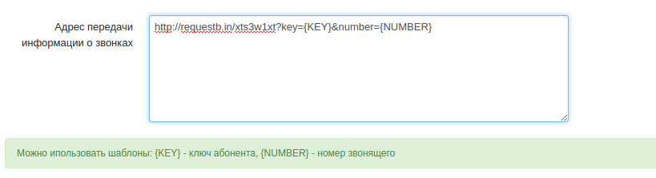
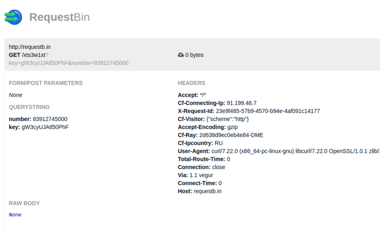

--- 
template: vpbx.jade
title: API & webhooks
order: 10
---

## API & webhooks

### API 

API позволяет взаимодействовать сторонним системам с сервисами Виртуальной АТС. 

Для совершения действий вам необходимо узнать соответствующий ключ абонента (пользователя портала Виртуальной АТС). 

#### Инициирование вызова

Для совершения вызова с абонента Виртуальной АТС на определенный номер можно сделать http запрос. После запроса придет вызов на абонента, а после ответа абонента вызов пойдет на вызываемый номер.


`````
http://connect.mobilon.ru/api/call/CallToSubscriber?key={userkey}&outboundNumber={number}

`````
где {userkey} - это ключ абонента, {number} - вызываемый номер.

Результат выполнения запроса приходит в формате [JSON](http://ru.wikipedia.org/wiki/JSON). 

Успешное выполнение
`````
{ "result": "SUCCESS", "message": "Звонок инициирован" }
`````

Неуспешное выполнение
`````
{ "result": "FAIL", "message": "Неверный ключ" }

`````

#### curl

`````
curl -X GET http://connect.mobilon.ru/api/call/CallToSubscriber\?key\={key}\&outboundNumber\={number}

`````

#### Полигон

[попробовать онлайн-запрос](https://antirek.github.io/mobilon-demo)

#### Пример для 1С 8.х

Повешайте функцию на кнопку

`````
// key - ключ сотрудника, полученный в ВАТС
// number - номер, на который нужно позвонить
&НаСервере
Процедура Позвонить(key, number)
    НТТР = Новый HTTPСоединение("connect.mobilon.ru");
    Запрос = Новый HTTPЗапрос("/api/call/CallToSubscriber/?key="+СокрЛП(key)+"&outboundNumber="+СокрЛП(number));
    Ответ = НТТР.Получить(Запрос);

    Если Ответ.КодСостояния <> 200 Тогда
        Сообщить("Не удалось совершить исходящий вызов");
    КонецЕсли;
КонецПроцедуры

`````


### Webhooks 

Веб-хуки - адреса в сети интернет, которые могут быть запрошены во время обработки звонков Виртуальной АТС.


#### Получение звонков абонентами

В настройках Виртуальной АТС укажите веб-адрес системы, куда необходимо передавать информацию о звонке.

Также можно указать {NUMBER] - номер звонящего абонента, и {KEY} - ключ абонента, получившего вызов.



Результат запроса




#### Использование веб-хуков через 1С-SOAP (beta test)

[Инструкция](attachments/MobilonVATS-1C-integration.pdf)