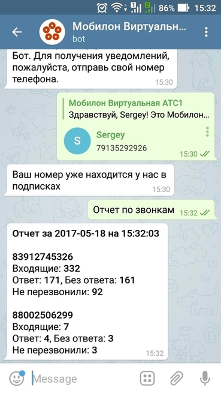

--- 
template: vpbx.jade
title: Бот Телеграм
order: 10
---

## Бот Телеграм

Бот Телеграм Виртуальной АТС Мобилон позволяет получать информацию о качестве обслуживания входящих вызовов.

Бот Телеграм по запросу отправляет информацию о количестве входящих звонков на каждый ваш номер, сообщает о количестве отвеченных и неотвеченных вызовов. А также информирует о количестве звонков, которые не дозвонились до вас с первого раза и больше не перезванивали, т.е. потерянные для вас клиенты.

Бота подключить легко - найдите его в Телеграм по имени <strong>MobilonVATSBot</strong>. 

Или перейдите по ссылке https://telegram.me/MobilonVATSBot  

#### Оперативная информация на вашем смартфоне

