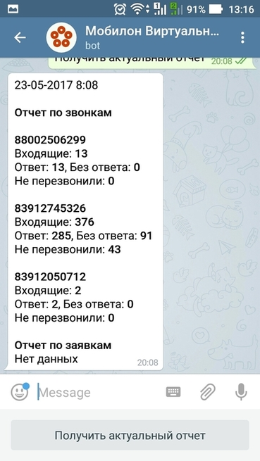

--- 
template: vpbx.jade
title: Бот Телеграм
order: 10
---

## Бот Телеграм

Бот Телеграм Виртуальной АТС Мобилон позволяет получать информацию о качестве обслуживания входящих вызовов.

Бот Телеграм по запросу отправляет информацию о количестве входящих звонков на каждый ваш номер, сообщает о количестве отвеченных и неотвеченных вызовов. А также информирует о количестве звонков, которые не дозвонились до вас с первого раза и больше не перезванивали, т.е. потерянные для вас клиенты.

### Как подключить бота?

Бота подключить легко - найдите его в Телеграм по имени <strong>MobilonVATSBot</strong>. 

Или перейдите по ссылке https://telegram.me/MobilonVATSBot  

Или отсканируйте QR-код (например, Viber'ом : )

Внимание! Затем в самом боте по команде /start вы получите приглашение отправить ваш номер телефона. Отправьте именно ваш номер телефона.

### Хей-хей, а безопасность?

Мы отправляем отчеты только на номера, которые указаны в настройках пользователей аккаунтов Виртуальной АТС Мобилон. Чтобы подключить номер вашего мобильного - обратитесь в техническую поддержку Мобилон.

Если вы подключитесь к боту, а ваш номер не указан в настройках Виртуальной АТС - отчетов не будет. Если вы отправите не тот номер - отчетов тоже не будет.

#### Оперативная информация на вашем смартфоне

###  Что значат эти цифры?

Рассмотрим данные на картинке выше. 

По каждому указанному номеру показывается следующая информация:

Входящие - всего поступивших входящих на номер за текущий день.

Ответ - сколько из этих входящих были отвечены на Виртуальной АТС Мобилон.

Неответ - сколько из этих входящих не были отвечены.

Не перезвонили - это самый интересный параметр, позволяющий оценить потери. Вам позвонил клиент, ему не ответили, затем он может перезвонить, а может и не перезвонить. Этот параметр показывает сколько позвонивших и получивших неответ повторно не перезвонили.
