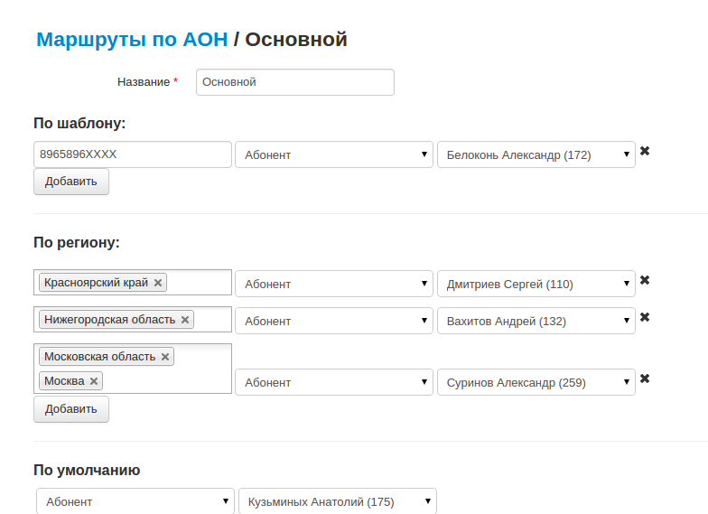

--- 
template: vpbx.jade
title: Маршрутизация по АОН
order: 10
---

## Маршрутизация по АОН

Маршрутизация по АОН, позволяет разделить звонки из разных регионов. Удобно направить звонки из Сибири на операторов в Новосибирске, а остальные звонки - на операторов в Вологде.

Информация о регионах РФ в [Википедии](https://ru.wikipedia.org/wiki/%D0%A1%D1%83%D0%B1%D1%8A%D0%B5%D0%BA%D1%82%D1%8B_%D0%A0%D0%BE%D1%81%D1%81%D0%B8%D0%B9%D1%81%D0%BA%D0%BE%D0%B9_%D0%A4%D0%B5%D0%B4%D0%B5%D1%80%D0%B0%D1%86%D0%B8%D0%B8). 

Информация о номерах и соответствии их регионам на [сайте Федерального агентства связи](http://rossvyaz.ru/activity/num_resurs/registerNum/).

В каждый регион включены все номера: стационарные (в коде ABC) и мобильные (в коде DEF).

