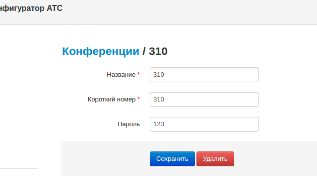

--- 
template: vpbx.jade
title: Конференции
order: 10
---

## Конференции

Телефонная конференция — телефонный разговор, в котором может принимать участие несколько сторон одновременно.

На Виртуальной АТС вы можете создать конференцию-комнату, где слышно всё, что говорит тот, кто к ней подключился. При звонке на внутренний номер конференции происходит подключение. 

Также вы можете закрыть доступ паролем, а пароль предоставить по электронной почте или иным способом только нужным людям. 

К конференции могут подключиться сторонние абоненты (а не только внутренние абоненты АТС), достаточно настроить маршрутизацию на телефонном номере (напрямую или через голосовое меню).

