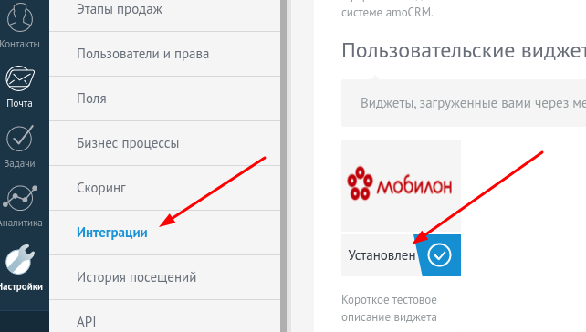
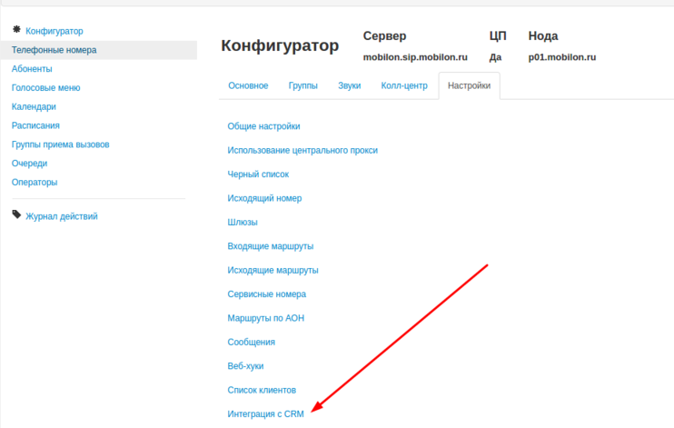
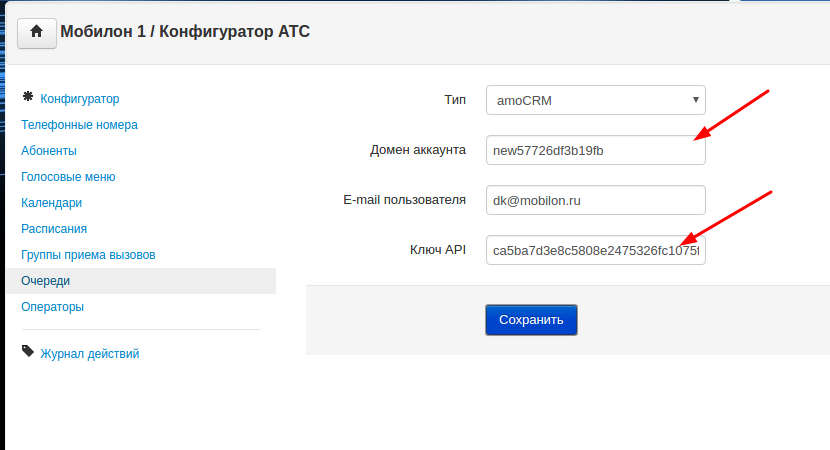
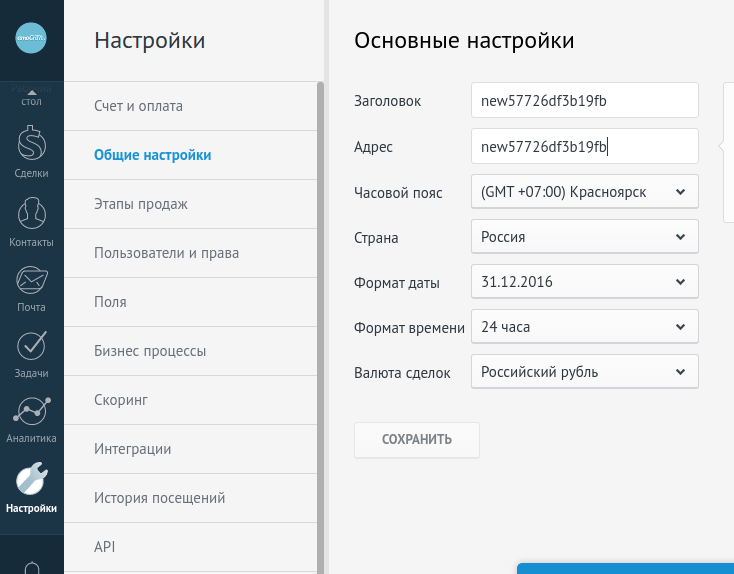
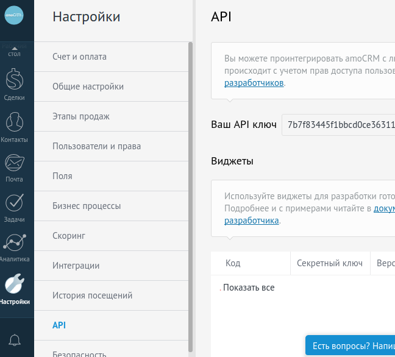
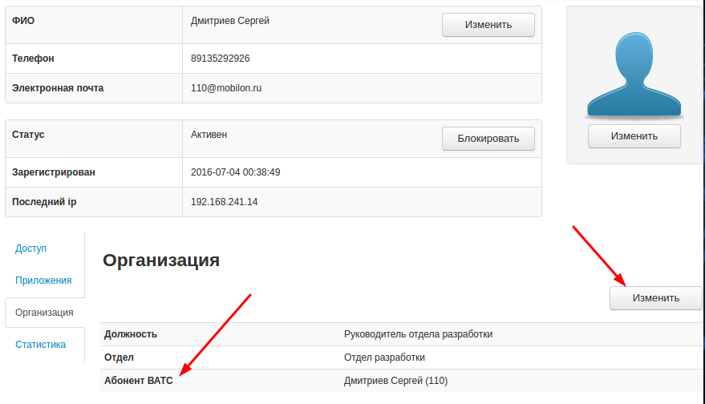

--- 
template: crm.jade
title: Настройка
order: 20
---

## Настройка

Чтобы интегрировать на совместную работу две системы, необходимо:

1. Установить виджет Мобилон на платформе AmoCRM

2. Настроить AmoCRM

3. Настроить Виртуальную АТС Мобилон

### Основные правила интеграции

1. Интеграция базируется на соответствии пользователей Виртуальной АТС и пользователей AmoCRM на основе адреса электронной почты.

2. Пользователь Виртуальной АТС также должен иметь асоциированного абонента Виртуальной АТС, чтобы у него была возможность совершать и принимать звонки.

### AmoCRM

Установленный виджет в разделе Интеграции

*При установке требуется ввести API-Token Виртуальной АТС Мобилон. Его можно получить в настройках Виртуальной АТС, раздел Аккаунт, меню Настройки -> API-Token.

### Виртуальная АТС Мобилон

В настройках Конфигуратора пункт Интеграция с CRM

Необходимо указать домен, емейл пользователя и его ключ API.

Домен можно посмотреть здесь:

А ключ API здесь:

Установка связи пользователя Виртуальной АТС и абонента осуществляется в разделе Аккаунт - Пользователи.

