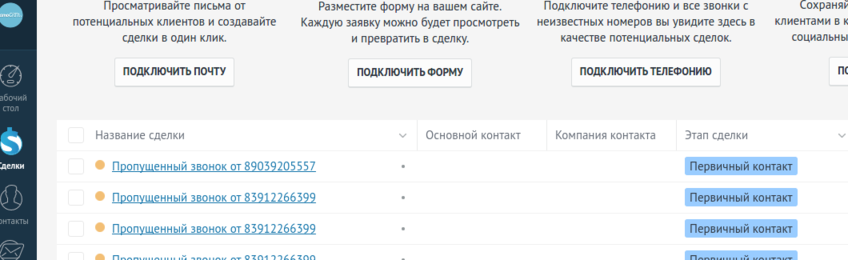

--- 
template: crm.jade
title: Пропущенные вызовы
order: 50
---

## Пропущенные вызовы

Интеграция AmoCRM и сервиса Виртуальной АТС Мобилон позволяет зафиксировать пропущенные звонки в виде сделок. Чтобы вы могли оперативно обработать эти звонки.

Для работы функции - необходимо включить галочку "Добавлять входящие звонки без ответа в сделки" в разделе Конфигуратор - Настройки - Интеграция с AmoCRM.