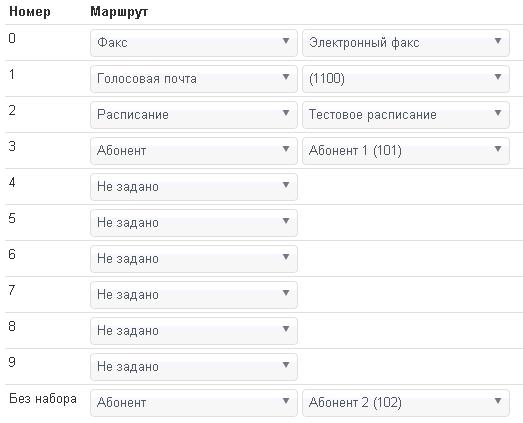

--- 
template: vpbx.jade
title: Голосовые меню
order: 10
---

## Голосовые меню

### Создание

Так же существует возможность создания голосовых меню, которые будут приветствовать позвонившего, а так же предлагать ввести внутренний номер абонента или выбрать какой-либо пункт меню, что бы попасть в нужный отдел. Во вкладке «Настройки» вы найдете пункт «Голосовое меню», в котором так же увидите список существующих меню и возможность создать новое. При создании вы сможете выбрать название, и провести первичную настройку выбрав маршруты или расписания для каждого необходимого варианта.

После сохранения этого меню, найдите его в списке и нажмите кнопку «просмотреть», нажав на кнопку «Дополнительно» вы сможете выставить галочку для разрешения набора внутренних номеров абонентов помимо пунктов меню. А так же выставить время в течение, которого будет ожидаться набор цифр после проигрывания приветственного сообщения.

Во вкладке «Звуки» вы сможете выбрать приветственное сообщение, при неправильном наборе номера и при отсутствии ответа. Однако никаких звуков изначально в аккаунты не заложено, поэтому из этого окна необходимо перейти по кнопке «Список звуков» к перечню звуков закрепленных за аккаунтом. Там вы сможете нажать кнопку «Добавить сообщение», набрать название этого сообщения и загрузить необходимый звуковой файл в формате mp3, в будущем будут поддерживаться и прочие звуковые форматы. Загрузив все необходимые сообщения, вы можете вернуться во вкладку «Звуки» и выбрать соответствующие сообщения. Теперь остается только в настройке маршрута телефонного номера или в расписании выбрать данное голосовое меню и сохранить настройку. Если вам необходимо создать двух уровневое голосовое меню, следует создать еще одно меню и в основном указать переход на второе меню при нажатии какой-либо цифры.