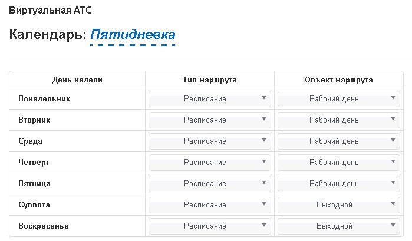
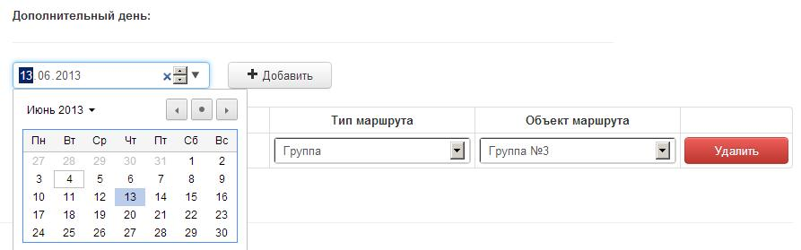
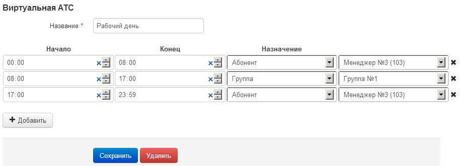

--- 
template: vpbx.jade
title: Календари и расписания
order: 10
---

## Календари и расписания

### Календари

Когда клиентам требуется различная маршрутизация звонка в рабочие и выходные дни, есть возможность создать календарь рабочих и выходных дней. В «Настройки» найдите пункт «Календарь», вы увидите список существующих календарей и сможете создать новый.

Нажмите кнопку «Просмотр» и вы перейдете в меню настройки маршрутов каждого дня недели.

Здесь вы можете выбрать индивидуальный маршрут для каждого дня недели, сделать его рабочим, сокращенным или выходным днем. Вы можете так же назначить даты-исключения для календарных дней заранее и задавать им свои уникальные маршруты.

Готовый календарь подключается в настройках маршрута на телефонном номере клиента (Телефонные номера/Маршрут). Выбрав пункт «Календарь» необходимо выбрать один из созданных вами графиков работы, и звонки на этот номер телефона будут распределяться с учетом дня недели.

### Расписания

Помимо разделения на выходные и рабочие дни, предусмотрено выбирать какой либо из маршрутов в зависимости от времени суток. Для создания расписания зайдите в «Настройки» и выберите «Расписания». Здесь вы увидите список существующих расписаний и кнопку «Добавить расписание», нажав на нее, у вас будет возможность ввести название расписания и настроить маршрут (аналогично телефонным маршрутам на номере телефона) для произвольного количества временных промежутков.

Нажимая кнопку «Добавить» вы можете создавать временные сегменты, далее аналогично выбирать им необходимые действия при поступлении звонка.