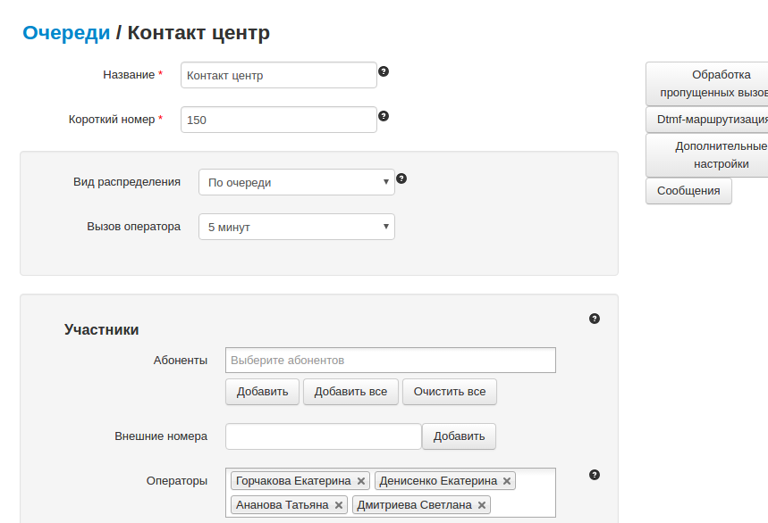

--- 
template: vpbx.jade
title: Очереди
order: 10
---

## Очереди

Очереди используются для организации упорядоченного обслуживания входящих вызовов. Обслуживают вызовы в очереди или обычные абоненты Виртуальной АТС, или динамически регистрируемые операторы Виртуальной АТС. 

В процессе ожидания у звонящего абонента проигрывается музыка или информационное сообщение. По мере продвижения по очереди звонящего абонента может происходить информарование абонента о времени ожидания или наличии дополнительных возможностей.

