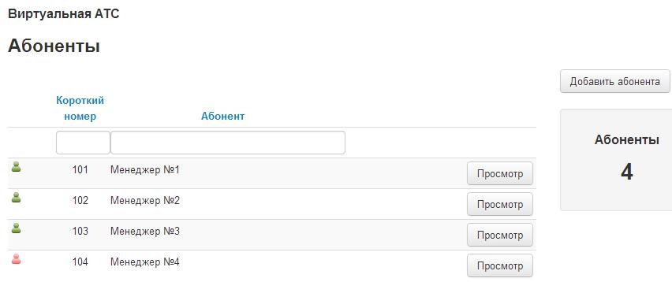
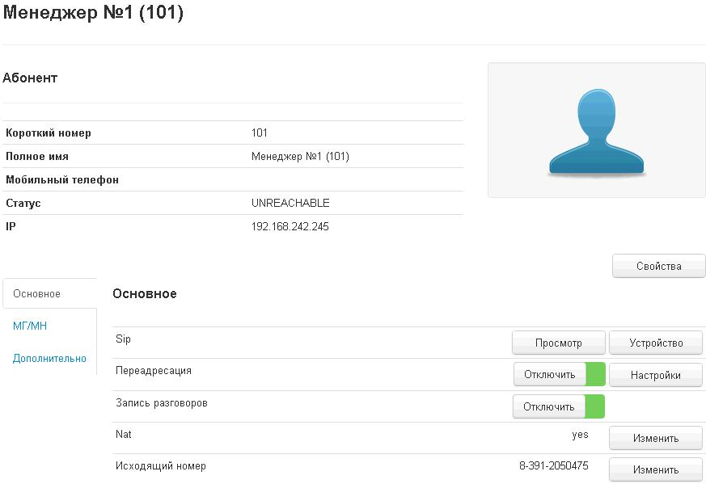
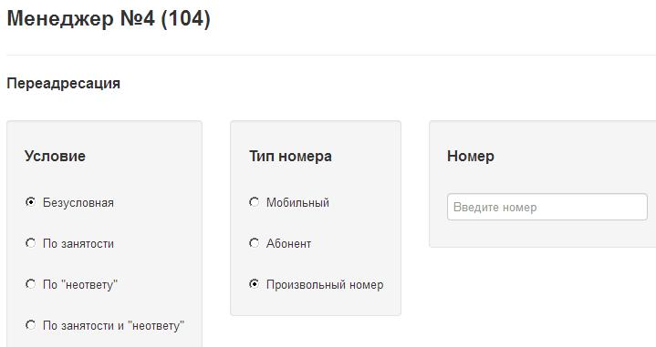
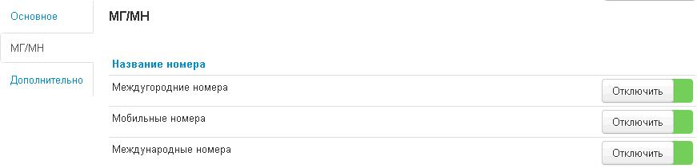
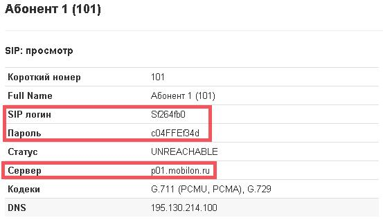
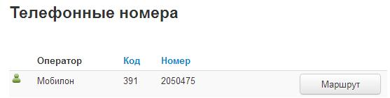
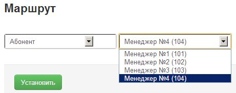

--- 
template: vpbx.jade
title: Абоненты
order: 10
---

## Абоненты

### Создание

Для создания абонента необходимо перейти во вкладку «Абоненты», затем нажать кнопку «Добавить абонента».

Для создания абонента необходимо будет ввести короткий номер и название (например ФИО абонента, должность и т.д.), опционально прописывается мобильный номер, который будет использоваться для переадресации звонков и быстрого набора через звездочку (hint: набрав * и короткий номер данного абонента, звонок автоматически пойдет на его сотовый). Если номер не известен, в дальнейшем его можно будет прописать или изменить в свойствах абонента, переход на которые мы увидим, нажав кнопку «просмотр» напротив его имени.

### Переадресации

В строке «Переадресация», при нажатии кнопки «создать», вы можете задать правила для перемаршрутизации звонка на сотовый абонента, другого абонента или сторонний номер.

При выборе «Безусловная», звонок будет уходить на указанное вами направление, минуя абонента. Условие «По занятости» будет срабатывать только если абонент уже разговаривает, а «По не ответу» если звонок не был обработан в течении заданного вами времени. Четвертый вариант комбинированный. После сохранения данной переадресации у вас в настройках абонента появится кнопка для включения и отключения данной переадресации.

### Ограничения связи

Так же вы можете устанавливать ограничения на исходящие звонки, во вкладке «МГ/МН» у каждого абонента в отдельности.

### Параметры подключения SIP

Данный абонент уже готов для подключения к виртуальной АТС по SIP, все необходимые данные можно найти, нажав кнопку «Просмотр» в строчке Sip. Здесь вы увидите логин, пароль и сервер регистрации. Стоит отметить, что логины и пароли генерируются системой и изменить их на произвольные нельзя.

### Настройка маршрута

Теперь во вкладке «Телефонные номера» вы можете настроить маршрут для выделенных клиенту номеров.

Нажав кнопку «Маршрут» вы попадете в меню настройки, в выпадающем меню вы увидите множество вариантов действий при звонке на этот номер, простейший – «Абонент», при выборе этого варианта правее появится еще один выпадающий список, в котором вы можете выбрать одного абонента из списка всех существующих.

