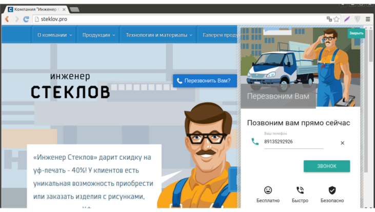

--- 
template: webcall.jade
title: Об услуге
order: 10
---

## Об услуге

Услуга "Звонок с сайта" предназначена для получения быстрой обратной связи от посетителей Вашего сайта.

### Основные фишки

1. Красивый стильный виджет, установка которого занимает считанные минуты.

2. Различные сценарии приема звонков.

3. API, webhooks

4. Журнал запросов с записями состоявшихся разговоров.

### Еще примеры

Хотите посмотреть еще примеров виджета Звонка с сайта? На этой странице представлены некоторые сайты наших клиентов: <a href="http://antirek.github.io/callButton.js-screenshots/" target="_blank">http://antirek.github.io/callButton.js-screenshots/</a>

### Создайте свой виджет

Не понравился наш стандартный виджет? И хотите сделать свой? Воспользуйтесь нашей библиотекой для заказа обратного звонка: <a href="https://github.com/antirek/webcall-mobilon.js" target="_blank">https://github.com/antirek/webcall-mobilon.js</a>